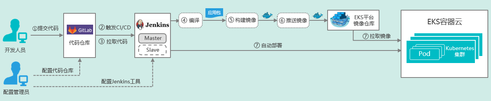

# 概述 （Ready） 
本文档为基于EKS V4.0.2易捷行云容器云平台的CI/CD（持续集成/持续部署）场景实践指南，主要包含以下两部分：  
1. 在EKS平台上部署CI/CD工具链；
2. 借助不同类型的应用示例，进行CI/CD场景演示。  

# 场景描述  
1. CI/CD工具链基于业界目前主流、通用的开源软件构建，均在EKS平台中基于Kubernetes进行部署。  
<table>
   <tr>
      <td>序号</td>
      <td>用途</td>
      <td>工具</td>
      <td>Docker镜像版本</td>
      <td>说明</td>
   </tr>
   <tr>
      <td>1</td>
      <td>代码版本管理</td>
      <td>GitLab</td>
      <td>gitlab/gitlab-ce:10.3.7-ce.0</td>
      <td></td>
   </tr>
   <tr>
      <td>2</td>
      <td>CI/CD工具</td>
      <td>Jenkins</td>
      <td>jenkinsci/blueocean:1.5.0</td>
      <td>Jenkins Slave节点的镜像需要自己制作</td>
   </tr>
</table>  

2. CI/CD工具链可通过以下两种方式在EKS平台上部署：  
   1）通过EKS平台的UI界面直接完成部署，其中Jenkins Slave通过Jenkins Master调用EKS接口生成；    
   2）通过Helm完成CI/CD工具链在EKS中的部署（见[高级实践](../高级实践）。   

3. 应用示例包括：Javascript应用、Dubbo微服务应用等。    

# CI/CD流程描述  
在完成CI/CD工具链部署之后，整体CI/CD场景流程图如下所示：  
   
1. 提交代码：开发人员通过Git工具提交代码至GitLab代码仓库的对应分支； 
2. 触发CI/CD：GitLab与Jenkins集成，当检测到相应分支的代码更新时，自动触发CI/CD流水线，Jenkins Master将会在EKS中自动创建Jenkins Slave，并执行后续CI/CD流程；  
3. 拉取代码：Jenkins Slave自动从GitLab中拉取更新的代码；  
4. 代码编译：Jenkins Slave执行代码编译，生成应用包；  
5. 镜像构建：Jenkins Slave执行Docker镜像构建；  
6. 推送镜像：Jenkins Slave将生成的Docker镜像推送至EKS的镜像仓库中；  
7. 自动部署：Jenkins Slave将新版本应用部署至EKS平台中，此过程会从镜像仓库拉取新版本镜像。  
