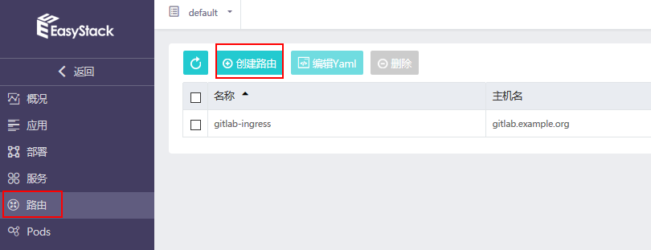
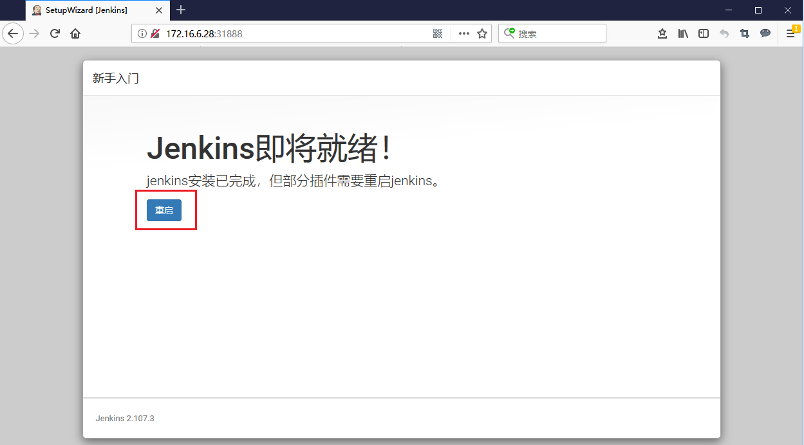
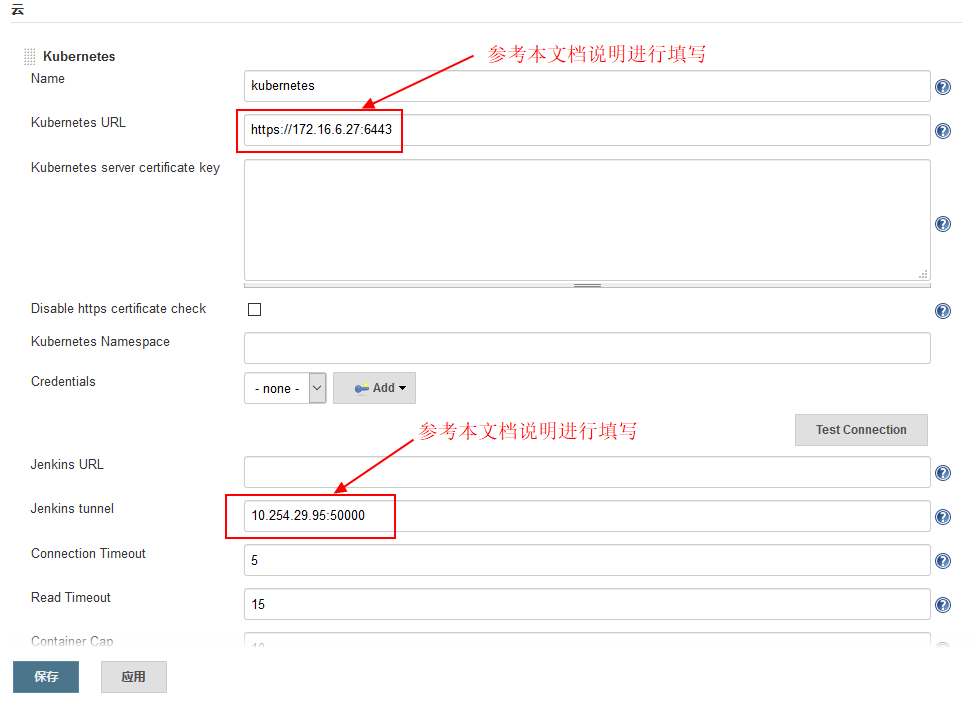

# 搭建CI/CD工具链 （Ready）   
本文档主要介绍如何在EKS容器云平台中搭建由GitLab和Jenkins组成的CI/CD工具链，并完成必要的配置。  
**耗时：约60-90分钟**  

## 1. GitLab代码仓库部署与配置  

### Step 1: 上传GitLab镜像至EKS平台的镜像仓库  

首先需要准备一个安装有单机版Docker CE软件的操作系统环境用于上传Docker镜像，可以使用本地虚拟机，也可以使用ECS平台中的云主机，注意需要能够与EKS镜像仓库实现网络互通。  

注意：需要配置Docker Daemon的DOCKER_OPTS参数，添加“--insecure-registry x.x.x.x”参数。  
不同操作系统的配置方式略有差异，请以Docker官方说明为准。  
以本文档所采用的CentOS 7.2.1511为例，可参考以下配置方法：  
```
[root@docker-ce ~]# vi /usr/lib/systemd/system/docker.service
```
配置参考示例如下：  


然后执行：  
```
[root@docker-ce ~]# systemctl daemon-reload  
[root@docker-ce ~]# systemctl restart docker  
```

尝试登陆镜像仓库，参考EKS界面“本地镜像仓库"-"上传镜像"的步骤说明：  


提示“Login Succeed”之后，便可以将本地的镜像推送至镜像仓库。  
首先需将所需版本的GitLab镜像下载到本地（需能够访问外网从Dockerhub拉取镜像）：  
```
[root@docker-ce ~]# docker pull gitlab/gitlab-ce:10.3.7-ce.0
```  

修改镜像的Tag，并上传镜像到EKS平台的镜像仓库中:  
```
[root@docker-ce ~]# docker images
[root@docker-ce ~]# docker tag gitlab/gitlab-ce:10.3.7-ce.0  172.16.0.176/3dc70621b8504c98/gitlab-ce:10.3.7-ce.0
[root@docker-ce ~]# docker push 172.16.0.176/3dc70621b8504c98/gitlab-ce:10.3.7-ce.0
```  

注：GitLab镜像使用指南可参考 https://docs.gitlab.com/omnibus/docker/#run-the-image  

可以在EKS界面查看已上传至镜像仓库的GitLab镜像，接下来会基于它来部署GitLab应用。   

  

### Step 2: 在EKS容器平台中部署GitLab应用  

点击EKS界面"创建应用"，并选择通过"镜像仓库"开始创建。  

  
  

填写“应用名称”，然后点击“添加服务”，在弹出框中填入服务的各项配置参数。  
填写“服务名称”，选择上一步所上传的GitLab镜像，填入Pod的基本配置：  
  
注意：  
1）GitLab容器消耗计算资源比较多，因此图示中分配了4Cores/4096MiB计算资源；  
2）需要配置持久化存储，将容器的3个目录/var/opt/gitlab （存储应用数据)、 /var/log/gitlab （存储log文件）、 /etc/gitlab（存储配置文件）挂载出来。  

下一步，填写服务（即Kubernetes Service）访问设置，在这里我们选取NodePort方式，将GitLab容器的3个端口（80、22和443）暴露出来，映射服务端口也设为80、22和443，另外，指定对应的节点暴露端口30080、30022和30443，如图示例：
  

下一步，注入环境变量至GitLab容器中，在“高级配置”中进行设置，参考下图：  
  
图示中键填入为： ```GITLAB_OMNIBUS_CONFIG```   
值填入为：  ```external_url 'http://gitlab.example.org/'; gitlab_rails['gitlab_shell_ssh_port'] = 30022;```  
分别代表GitLab的外部访问域名和SSH连接端口，其中外部访问域名还需要在接下来的Ingress路由中设置。  

保存上述配置，便可以部署GitLab应用。  
可在EKS界面查看已经创建完成的GitLab应用。  
  

此时已经可以通过NodePort方式访问GitLab，但是为了在Web浏览器中可直接通过域名（本示例为gitlab.example.org）访问GitLab，我们可以设置路由(Ingress)，提供外部负载均衡访问GitLab界面。  
  
  
注意需要配置DNS域名解析才可通过域名访问GitLab，可采用以下两种方式：  
1）如果环境中有DNS服务器，则直接配置DNS解析即可，例如将上图中的gitlab.example.org映射到Kubernetes集群的某一个Slave节点的公网IP（注意不能为Master节点）；  
2）如果环境中没有DNS服务器，则可以配置本地hosts文件（对Windows而言为C:\Windows\System32\drivers\etc\hosts），添加任意一个Kubernetes Slave节点公网IP与域名的映射关系，对于本文档中的示例则可添加一条： 172.16.6.30 gitlab.example.org  

等待3~4分钟GitLab完成初始化之后，即可通过浏览器正常访问GitLab：  
  
注册一个新的账号即可正常使用。  

### Step 3: 设置通过SSH连接GitLab  
考虑安全性，我们通过SSH Key Pair方式访问GitLab。(参考：https://docs.gitlab.com/ee/ssh/README.html)    
在Step1中所使用的本地虚拟机中，创建一个GitLab SSH密钥对：（提示：需要设置并牢记私钥密码。）   
```
[root@docker-ce .ssh]# ssh-keygen -t rsa -C "easystack@example.org" -b 4096
```
随后将公钥（默认文件名为id_rsa.pub）添加到GitLab中，在GitLab的“User Setting”-“SSH Keys”中进行添加：  
   

验证本地虚拟机与GitLab的SSH连通性：  
   
后续将使用SSH方式上传（Push）源代码至GitLab中。  

### Step 4：创建Access Token  
在CI/CD演示中，有可能需要创建Private类型的GitLab项目，在这种情况下建议创建```Access Token```，用于认证。  
在GitLab界面【GitLab】-【Setting】-【Access Tokens】中创建：    
  

请妥善保存生成的```Access Token```。 
  

## 2. Jenkins部署与配置  

### Step 1: 上传Jenkins镜像至EKS平台的镜像仓库   
采用与之前下载GitLab镜像类似的方式，首先需将所需版本的GitLab镜像下载到本地，然后推送至EKS平台的镜像仓库。  
```
[root@docker-ce ~]# docker pull jenkinsci/blueocean:1.5.0
[root@docker-ce ~]# docker tag jenkinsci/blueocean:1.5.0  172.16.0.176/3dc70621b8504c98/jenkinsci/blueocean:1.5.0
[root@docker-ce ~]# docker push 172.16.0.176/3dc70621b8504c98/jenkinsci/blueocean:1.5.0
```
注：Jenkins BlueOcean镜像使用指南可参考 https://jenkins.io/doc/book/installing/#downloading-and-running-jenkins-in-docker

可以在EKS界面查看已上传至镜像仓库的Jenkins镜像，接下来会基于它来部署Jenkins Master：  

 

###  Step 2: 在EKS平台中部署Jenkins Master   

点击EKS界面"创建应用"，并选择通过"镜像仓库"开始创建，使用之前上传的Jenkins BlueOcean镜像作为Jenkins Master的基础镜像。  

  
注意需要配置持久化存储，将容器的目录/var/jenkins_home挂载出来。  

  
服务（Service）访问设置中需要配置暴露两个端口：  
1）Jenkins Server的访问端口，默认容器端口为8080，图示采用NodePort方式指定对外暴露节点端口为31888；  
2）Jenkins Master与Slave之间通信所使用的端口，默认容器端口为50000。  

注意：按照前述步骤完成Jenkins Master部署之后，Jenkins Master应用的Pod并不会处于正常Running状态，还需要进一步设置Root用户权限。  
具体步骤如下：  
对Master的部署（Deployment）Yaml模板进行编辑，修改**securityContext**来设置访问/var/jenkins_home的用户为root用户，添加配置**runAsUser: 0**，如下图所示：  


编辑并保持部署Yaml文件后，Jenkins Master的Pod会重新创建，随后变为正常“运行中”状态，在EKS平台可以查看处于正常“运行中”状态的Jenkins Master：  
  
  
 
#### 创建Service Account    
另外，在本次场景设计中，Jenkins Slave需要在EKS的Kubernetes集群中动态生成/删除，因此需要Jenkins Master能够Kubernetes集群的ApiServer进行通信，并通过权限认证，从而后端动态创建Jenkins Slave。在这里我们使用Kubernetes的Service Account来实现授权功能。  

>  Service Account:
> 相对于kubectl访问apiserver时用的User Account，Service Account是为了给Pod中的Process访问Kubernetes API提供的一种身份标识。简而言之，通过Service Account可以实现给Pod中的进程授权访问Kubernetes API。

具体步骤如下：
通过私钥后台登陆EKS的Kubernetes Master节点，创建Service Account的Yaml文件，具体内容参考如下：  
jenkins-rbac.yaml
```
---
apiVersion: v1
kind: ServiceAccount
metadata:
  labels:
    k8s-app: jenkins
  name: jenkins-admin
  namespace: default
---
apiVersion: rbac.authorization.k8s.io/v1beta1
kind: ClusterRoleBinding
metadata:
  name: jenkins-admin
  labels:
    k8s-app: jenkins
roleRef:
  apiGroup: rbac.authorization.k8s.io
  kind: ClusterRole
  name: cluster-admin
subjects:
- kind: ServiceAccount
  name: jenkins-admin
  namespace: default
```
在Kubernetes Master节点中使用以上Yaml文件来创建名为**jenkins-admin**的ServiceAccount:   
```
[root@ci-akyzklrim5-0-vsx3xunzxan2-kube-master-gko2lwdxza5r escore]# kubectl create -f jenkins-rbac.yaml 
```
  

说明：此处创建的ServiceAccount，直接继承了cluster-admin的权限。也可以根据自己实际情况，创建指定权限的ClusterRole。   

可以在Kubernetes Master节点查看已创建的Service Account和ClusterRoleBinding，参考下图所示：   
 

下一步，需要再次修改Jenkins Master的部署(Deployment)的Yaml文件，添加已创建的名为**jenkins-admin**的Service Account，即：  
```
      serviceAccount: jenkins-admin
      serviceAccountName: jenkins-admin
```
可参考下图所示：    
 

编辑并保持部署Yaml文件后，Jenkins Master的Pod会重新部署，随后再次处于“运行中”状态。   

#### 首次登陆Jenkins  
通过Web浏览器访问http://<EKS任意Node的公网IP:Nodeport>，进入Jenkins界面，对于本文档示例即可访问http://172.16.6.28:31888/   
首次登陆Jenkins，需要输入初始密码：   


可以参考以下步骤获取初始密码：  
在EKS的Master节点执行以下命令，获取Jenkins Master的Pod名称：    
```
[escore@ci-akyzklrim5-0-vsx3xunzxan2-kube-master-gko2lwdxza5r ~]$ kubectl get pod
```

然后参考以下命令行打印Jenkins初始密码：    
```
[root@ci-akyzklrim5-0-vsx3xunzxan2-kube-master-gko2lwdxza5r escore]# kubectl exec -it jenkins-master-jenkins-master-5vbl59kr-4292895683-0zj7j cat /var/jenkins_home/secrets/initialAdminPassword
```
 

获取初始密码并输入后，可以选择第一次登陆Jenkins系统建议的“安装推荐的插件”步骤：   
  
(注：本步骤需要访问Internet，您也可以跳过本步骤，后续可按需添加插件。)    

随后“创建第一个管理员用户”：   

 

按照提示“重启”Jenkins之后，即可重新登陆并正常使用：  
 
 


### Step 3: 安装Jenkins插件    

本次实践中，我们使用的Jenkins镜像默认已经预装了BlueOcean插件。另外，我们还需要使用以下Jenkins插件：  
<table>
   <tr>
      <td>1</td>
      <td>docker-build-step</td>
   </tr>
   <tr>
      <td>2</td>
      <td>Git</td>
   <tr>
      <td>3</td>
      <td>GitLab</td>
   <tr>
      <td>4</td>
      <td>GitLab Hook</td>
   <tr>
      <td>5</td>
      <td>Kubernetes</td>
   </tr>
</table>  

进入Jenkins-【系统管理】-【管理插件】界面：   


在【可选插件】中选择找到所需的插件，并依次进行安装：  

注： 如果上一步在初始化Jenkins过程中选择了“安装推荐的插件”，则此处只需要安装之前未安装的插件。  

插件安装过程中需要选择“安装完成后重启Jenkins”:    

 

可在【已安装】中查看已安装插件列表：   


> 备注:  
> 以上Jenkins插件安装过程均需要访问Internet，如果在数据中心内网环境进行操作，则无法正常安装插件。解决方法：离线下载Jenkins插件，将插件与Jenkins Master镜像（jenkinsci/blueocean:1.5.0）一起打包生成新的镜像，并将新的镜像上传至EKS平台的镜像仓库。    

### Step 4: 配置Jenkins   
在【系统管理】-【系统设置】-【新增一个云】-【Kubernetes】中，完成Jenkins与Kubernetes相关的配置，下图为示例配置：     

  

其中Kubernetes URL和Jenkins tunnel地址需要按照实际情况进行调整，具体方法如下：  
1）Kubernetes URL查看方法，在ECS云平台UI界面-【网络资源】-【负载均衡】，找到Kubernetes集群ApiServer对应的LB的公网IP，并使用默认的6443端口：    
  
  

点击“Test Connection”进行Jenkins与EKS Kubernetes集群ApiServer的连通性测试，如果配置正确则会提示“Connection test successful”：  


2）Jenkins tunnel地址：IP地址使用Jenkins Master对应的服务（Kubernetes Service）的集群服务地址（ClusterIP），对于本示例即为10.254.250.54，并使用50000端口。   


以上两项是必须配置项，您也可以根据实际情况进行更多的配置，例如修改Kubernetes-Name字段，不使用默认的“kubernetes”作为Name。  


### Step 5: 验证Jenkins Pipeline   
完成以上配置后，您可以在Jenkins中创建一个最简单的“hello world” Pipeline进行验证： 
  

在流水线编辑框中填入如下所示的“hello world”测试脚本：   
  
脚本如下：  
```
podTemplate(label: 'test', cloud: 'kubernetes') {
    node('test') {
        stage('Run shell') {
            sh 'echo hello world'
        }
    }
}
```

保存流水线配置，随后点击“立即构建”开始执行任务构建：  
  

> 注：在“hello world”这个Pipeline过程中，Jenkins后台将会自动从Dockerhub镜像仓库中拉取默认的Jenkins Slave镜像jenkins-slave:alpine，拉取镜像过程需要耗费一定时间，且容易由于网络问题拉取失败，建议保持耐心多尝试几次。  

可以在EKS界面中观察到后端自动创建的作为Jenkins Slave的Pod： 


查看Jenkins正在执行构建过程的任务的控制台输出：  


等待任务构建完成之后，可以发现Jenkins Slave Pod被自动删除。    

### Step 6: 添加证书（可选）   
>注：如果后续CI/CD演示项目均采用Blue Ocean方式构建，则无需此步配置。    

为保证Jenkins和GitLab之间能够使用SSH通信，需要在Jenkins中添加证书（Credential）。证书使用之前GitLab中添加的公钥所对应的私钥，参考“GitLab代码仓库部署与配置”-“Step 3: 设置通过SSH连接GitLab”。  
在Jenkins界面中点击【Jenkins】-【Credendials】-【System】-【Add domain】，添加一个domain。  
  

点击【Add Credentials】，添加证书。  
  

选择“SSH Username with private key”，在编辑框中填入之前GitLab中添加的公玥所对应的私钥，以及私钥的密码。  
  

可以查看并更新所创建的证书。  
  
