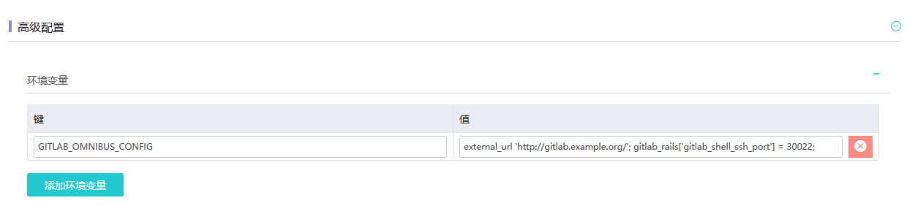
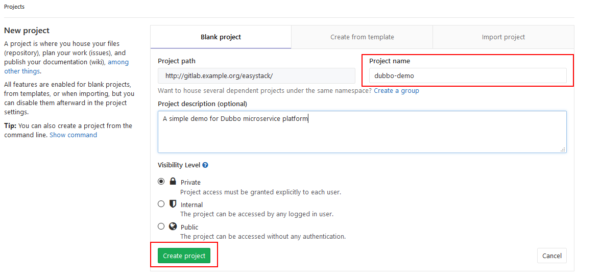
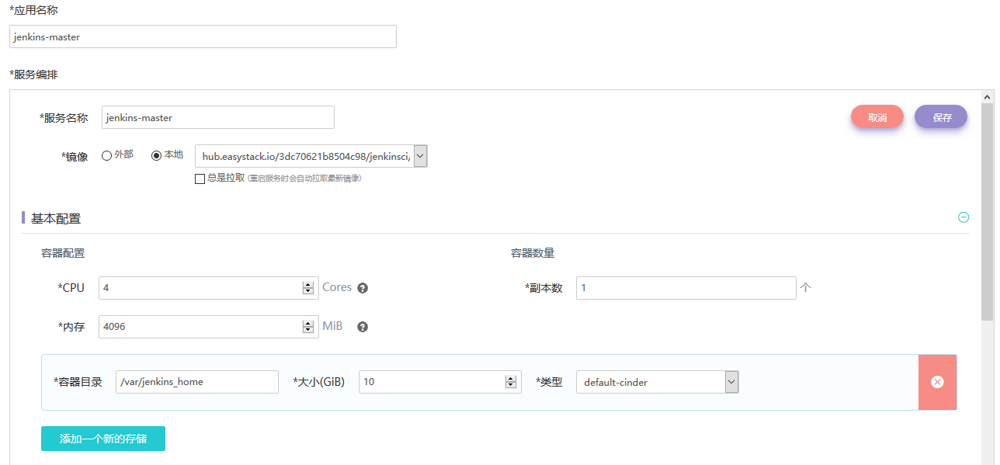
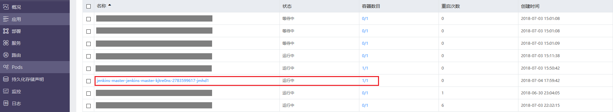
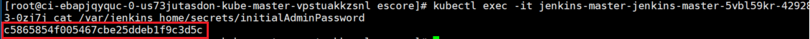

# 搭建CI/CD流水线  
本文档主要介绍如何在EKS容器云平台中部署GitLab与Jenkins，并完成必要的配置。  

## 1. GitLab代码仓库部署与配置  

### 在EKS中部署GitLab代码仓库   

**Step 1: 上传GitLab镜像至EKS平台的镜像仓库。**   

首先需要准备一个安装有单机版Docker CE软件的操作系统环境用于上传Docker镜像，可以使用本地虚拟机，也可以使用ECS平台中的云主机，注意需要能够与EKS镜像仓库实现网络互通。  

注意：需要配置Docker Daemon的DOCKER_OPTS参数，添加“--insecure-registry x.x.x.x”参数。  
不同操作系统的配置方式略有差异，请以Docker官方说明为准。  
以本文档所采用的CentOS 7.2.1511为例，可参考以下配置方法：  
```
[root@docker-ce ~]# vi /usr/lib/systemd/system/docker.service
```
配置参考示例如下：  


然后执行：  
```
[root@docker-ce ~]# systemctl daemon-reload  
[root@docker-ce ~]# systemctl restart docker  
```

尝试登陆镜像仓库，参考EKS界面“本地镜像仓库"-"上传镜像"的步骤说明：  


提示“Login Succeed”之后，便可以将本地的镜像推送至镜像仓库。  
首先需将所需版本的GitLab镜像下载到本地（需能够访问外网从Dockerhub拉取镜像）：  
```
[root@docker-ce ~]# docker pull gitlab/gitlab-ce:10.7.4-ce.0
```  

修改镜像的Tag，并上传镜像到EKS平台的镜像仓库中:  
```
[root@docker-ce ~]# docker images
[root@docker-ce ~]# docker tag gitlab/gitlab-ce:10.7.4-ce.0  172.16.0.176/3dc70621b8504c98/gitlab-ce:10.7.4-ce.0
[root@docker-ce ~]# docker push 172.16.0.176/3dc70621b8504c98/gitlab-ce:10.7.4-ce.0
```  

注：GitLab镜像使用指南可参考 https://docs.gitlab.com/omnibus/docker/#run-the-image  

可以在EKS界面查看已上传至镜像仓库的GitLab镜像，接下来会基于它来部署GitLab应用。   


**Step 2: 在EKS容器平台中部署GitLab应用。**  

点击EKS界面"创建应用"，并选择通过"镜像仓库"开始创建。  

  
  

填写“应用名称”，然后点击“添加服务”，在弹出框中填入服务的各项配置参数。  
填写“服务名称”，选择上一步所上传的GitLab镜像，填入Pod的基本配置：  
  
注意：  
1）GitLab容器消耗计算资源比较多，因此图示中分配了4Cores/4096MiB计算资源；  
2）需要配置持久化存储，将容器的3个目录/var/opt/gitlab （存储应用数据)、 /var/log/gitlab （存储log文件）、 /etc/gitlab（存储配置文件）挂载出来。  

下一步，填写服务（即Kubernetes Service）访问设置，在这里我们选取NodePort方式，将GitLab容器的3个端口（80、22和443）暴露出来，映射服务端口也设为80、22和443，另外，指定对应的节点暴露端口30080、30022和30443，如图示例：
  

下一步，注入环境变量至GitLab容器中，在“高级配置”中进行设置，参考下图：  
  
图示中键填入为： GITLAB_OMNIBUS_CONFIG  
值填入为：  external_url 'http://gitlab.example.org/'; gitlab_rails['gitlab_shell_ssh_port'] = 30022;  
分别代表GitLab的外部访问域名和SSH连接端口，其中外部访问域名还需要在接下来的Ingress路由中设置。  

保存上述配置，便可以部署GitLab应用。  
可在EKS界面查看已经创建完成的GitLab应用。  
  

此时已经可以通过NodePort方式访问GitLab，但是为了在Web浏览器中可直接通过域名（本示例为gitlab.example.org）访问GitLab，我们可以设置路由(Ingress)，提供外部负载均衡访问GitLab界面。  
  
  
注意需要配置DNS域名解析才可通过域名访问GitLab，可采用以下两种方式：  
1）如果环境中有DNS服务器，则直接配置DNS解析即可，例如将上图中的gitlab.example.org映射到Kubernetes集群的某一个Slave节点的公网IP（注意不能为Master节点）；  
2）如果环境中没有DNS服务器，则可以配置本地hosts文件（对Windows而言为C:\Windows\System32\drivers\etc\hosts），添加任意一个Kubernetes Slave节点公网IP与域名的映射关系，对于上图中的示例则可添加一条： 172.16.4.191 gitlab.example.org  

等待3~4分钟GitLab完成初始化之后，即可通过浏览器正常访问GitLab：  
  
注册一个新的账号即可正常使用。  

**Step 3: 设置通过SSH连接GitLab。**  
考虑安全性，我们通过SSH Key Pair方式访问GitLab。(参考：https://docs.gitlab.com/ee/ssh/README.html)    
在Step1中所使用的本地虚拟机中，创建一个GitLab SSH密钥对：（提示：需要设置并牢记私钥密码。）   
```
[root@docker-ce .ssh]# ssh-keygen -t rsa -C "easystack@example.org" -b 4096
```
随后将公钥“gitlab_key.pub”添加到GitLab中，在GitLab的“User Setting”-“SSH Keys”中进行添加：  
   

验证本地虚拟机与GitLab的SSH连通性：  
   


**Step 4: 创建GitLab示例项目。（挪到后面去）**  
我们在GitLab中创建一个示例项目“dubbo-demo”：  
  
  

**Step 5: Push源代码至GitLab。（挪到后面去）**  
首先需要确认所使用的本地虚拟机环境中已经安装了Git，并完成Git global setup配置。  
然后从GitHub上将示例项目的源代码克隆（Clone）到本地虚拟机中：  
```
[root@docker-ce ~]# git clone https://github.com/PabloZhong/dubbo-demo.git
```
可参考GitLab中界面提示，通过SSH方式进行源代码Push：  
```
[root@docker-ce ~]# cd dubbo/
[root@docker-ce dubbo]# rm -rf .git
[root@docker-ce dubbo]# git init  
[root@docker-ce dubbo]# git remote add origin ssh://git@gitlab.example.org:30022/easystack/dubbo-demo.git  
[root@docker-ce dubbo]# git add .  
[root@docker-ce dubbo]# git commit -m "Initial commit"  
[root@docker-ce dubbo]# git push -u origin master  
```
<<<<<<< HEAD:1_基础实践/2_CICD工具链搭建.md
```
备注：需要在运行git命令的本机上修改hosts文件，加入IP gitlab.example.org这行
```
=======
改/etc/hosts
>>>>>>> 469026a5786519f2ec62cce1a422e5acee4aa464:1_基础实践/2_搭建CICD流水线.md
Push成功后即可在GitLab的“dubbo-demo”项目中看到源代码。  

**Step 6: 修改Dubbo配置文件。（挪到后面去）** 

（1）dubbo/dubbo-demo/dubbo-demo-consumer/src/main/assembly/conf/dubbo.properties

dubbo.registry.address=zookeeper://172.16.2.245:2181

（2）dubbo/dubbo-demo/dubbo-demo-provider/src/main/assembly/conf/dubbo.properties
dubbo.registry.address=zookeeper://172.16.2.245:2181


### 2.在EKS中部署Jenkins

**Step 1: 上传Jenkins镜像至EKS平台的镜像仓库。**  
采用与之前下载GitLab镜像类似的方式，首先需将所需版本的GitLab镜像下载到本地，然后推送至EKS平台的镜像仓库。 
```
[root@docker-ce ~]# docker pull jenkinsci/blueocean：1.5.0
[root@docker-ce ~]# docker tag jenkinsci/blueocean：1.5.0  172.16.0.176/3dc70621b8504c98/jenkinsci/blueocean：1.5.0
[root@docker-ce ~]# docker push 172.16.0.176/3dc70621b8504c98/jenkinsci/blueocean：1.5.0
```
注：Jenkins BlueOcean镜像使用指南可参考 https://jenkins.io/doc/book/installing/#downloading-and-running-jenkins-in-docker

可以在EKS界面查看已上传至镜像仓库的Jenkins镜像，接下来会基于它来部署Jenkins Master：  

 

**Step 2: 在EKS平台中部署Jenkins Master服务。**   

点击EKS界面"创建应用"，并选择通过"镜像仓库"开始创建，使用之前上传的Jenkins BlueOcean镜像作为Jenkins Master的基础镜像。  

  
注意需要配置持久化存储，将容器的目录/var/jenkins_home挂载出来。  

  
服务（Service）访问设置中需要配置暴露两个端口：  
1）Jenkins Server的访问端口，默认容器端口为8080，图示采用NodePort方式指定对外暴露节点端口为31888；  
2）Jenkins Master与Slave之间通信所使用的端口，默认容器端口为50000。  

注意：按照前述步骤完成Jenkins Master部署之后，还需要对Master的部署（Deployment）Yaml模板进行编辑，修改**securityContext**来设置访问/var/jenkins_home的用户为root用户，添加配置**runAsUser: 0**，如下图所示：  


编辑并保持部署Yaml文件后，Jenkins Master的Pod会重新部署，并正常运行，在EKS平台可以查看处于正常“运行中”状态的Jenkins Master：  
  
  
 
另外，在本次场景设计中，Jenkins Slave需要在EKS的Kubernetes集群中动态生成/删除，因此需要Jenkins Master能够Kubernetes集群的ApiServer进行通信，并通过权限认证，从而后端动态创建Jenkins Slave。在这里我们使用Kubernetes的Service Account来实现授权功能。  

>  Service Account:
> 相对于kubectl访问apiserver时用的User Account，Service Account是为了给Pod中的Process访问Kubernetes API提供的一种身份标识。简而言之，通过Service Account可以实现给Pod中的进程授权访问Kubernetes API。

具体步骤如下：
通过私钥后台登陆EKS的Kubernetes Master节点，创建Service Account的Yaml文件，具体内容参考如下：  
jenkins-rbac.yaml
```
---
apiVersion: v1
kind: ServiceAccount
metadata:
  labels:
    k8s-app: jenkins
  name: jenkins-admin
  namespace: default
---
apiVersion: rbac.authorization.k8s.io/v1beta1
kind: ClusterRoleBinding
metadata:
  name: jenkins-admin
  labels:
    k8s-app: jenkins
roleRef:
  apiGroup: rbac.authorization.k8s.io
  kind: ClusterRole
  name: cluster-admin
subjects:
- kind: ServiceAccount
  name: jenkins-admin
  namespace: default
```
在Kubernetes Master节点中使用以上Yaml文件来创建名为**jenkins-admin**的ServiceAccount:   
```
[root@ci-akyzklrim5-0-vsx3xunzxan2-kube-master-gko2lwdxza5r escore]# kubectl create -f jenkins-rbac.yaml 
```
  

说明：此处创建的ServiceAccount，直接继承了cluster-admin的权限。也可以根据自己实际情况，创建指定权限的ClusterRole。   

可以在Kubernetes Master节点查看已创建的Service Account和ClusterRoleBinding，参考下图所示：   
 

下一步，需要再次修改Jenkins Master的部署(Deployment)的Yaml文件，加入已创建的名为**jenkins-admin**的Service Account，即：  
```
      serviceAccount: jenkins-admin
      serviceAccountName: jenkins-admin
```
可参考下图所示：    
 

编辑并保持部署Yaml文件后，Jenkins Master的Pod会重新部署，随后再次处于“运行中”状态。   

接下来可以通过Web浏览器访问http://<EKS任意Node的公网IP>:<Nodeport>，进入Jenkins界面，对于本文档示例即可访问http://172.16.4.191:31888/   
首次登陆Jenkins，需要输入初始密码：   


可以参考以下步骤获取初始密码：  
在EKS的Master节点执行以下命令：    
```
[escore@ci-akyzklrim5-0-vsx3xunzxan2-kube-master-gko2lwdxza5r ~]$ kubectl get pod
```

进入相应的Jenkins Master Pod以便查看密码：    
```
[root@ci-akyzklrim5-0-vsx3xunzxan2-kube-master-gko2lwdxza5r escore]# kubectl exec -it jenkins-master-jenkins-master-kjtre0ns-2246927953-qsmz2 bash
bash-4.4# cat /var/jenkins_home/secrets/initialAdminPassword
```
 

获取初始密码并输入后，即可进入Jenkins页面正常使用：   


可以跳过第一次登陆Jenkins的“安装插件”步骤，直接开始使用Jenkins。    
在“Jenkins”-“用户”-“admin”-“设置”中，修改Jenkins的admin密码：  

 

**我目前走到这一步，前面文档已经修改好，后面的你再check一遍。  **  
**Step 3: 配置Jenkins。**   


#### 3.1	Jenkins插件安装
(用于jenkins的Docker插件调用)

step 1:安装以下jenkins插件：

Docker build step plugin

Git plugin

Gitlab plugin

Gitlab Hook Plugin

Maven Integration plugin

Kubernetes plugin

进入jenkins【系统管理】页面，选择【管理插件】中选择以上插件，并进行安装:


插件安装完成以后，在【系统管理】-【系统设置】-【新增一个云】-【Kubernetes】配置k8s的插件。


参考以上说明，进行配置。标记到的地方，是需要配置的必须信息，可以根据自己的情况进行配置。要注意的是，这里的Name字段配的名字，后面在配置pipeline的Jenkins任务时，是需要用到的（默认名字叫kubernetes）。然后点【Test Connection】，如果前面的Service Account配置的没问题的话，就会提示“Connection successful”，否则，会有访问apiserver的403权限报错。


配置完成后，创建一个最简单的“hello world” Pipeline进行验证：

```
podTemplate(label: 'testpod', cloud: 'kubernetes') {
    node('testpod') {
        stage('Run shell') {
            sh 'echo hello world'
        }
    }
}

```

注：在这个Pipeline过程中，Jenkins后台将会自动从Dockerhub镜像仓库中拉取默认的Jenkins Slave镜像jenkins-slave:alpine。 

点击Jenkins任务构建，可以在EKS界面中观察到后端自动创建的作为Jenkins Slave的Pod：


等待Pipeline构建完成之后，可以发现Jenkins Slave Pod被自动删除：   


