# CI/CD场景实践-JavaScript应用 （待修改） 

## 需要分以下几部分，来修改本部分文档：  
## 1）GitLab中创建项目，并上传代码。 
## 2）Jenkins中的流水线配置，包括GitLab自动触发Jenkins的CI构建的配置。
## 3）CICD场景如何进行演示。  
  

## 1. 制作用来编译snake源码的jenkins slave镜像：
为了完成使用jenkins slave来进行CI工作，需要自己制作一个jenkins slave镜像，并上传到我们的172.16.4.176 harbor中去，自己制作jenkins slave镜像步骤如下：

step1: 使用openshift参考镜像；  

step2: 编写Dockefile如下：
```
FROM centos:7

MAINTAINER zhangrong <rong.zhang@easystack.cn>

ENV HOME=/home/jenkins

USER root

# Add http://mirrors.ustc.edu.cn/ centos7 repo
RUN  mv /etc/yum.repos.d/CentOS-Base.repo /etc/yum.repos.d/CentOS-Base.repo.backup && \
     mv /etc/yum.repos.d/CentOS-SCLo-scl-rh.repo /etc/yum.repos.d/CentOS-SCLo-scl-rh.repo.backup
ADD  contrib/repo/*  /etc/yum.repos.d/

# Install headless Java
RUN yum install -y centos-release-scl-rh && \
    INSTALL_PKGS="bc gettext git java-1.8.0-openjdk-headless java-1.8.0-openjdk-headless.i686 lsof rsync tar unzip which zip" && \
    yum install -y --setopt=tsflags=nodocs install $INSTALL_PKGS && \
    rpm -V $INSTALL_PKGS && \
    yum clean all && \
    mkdir -p /home/jenkins && \
    chown -R 1001:0 /home/jenkins && \
    chmod -R g+w /home/jenkins && \
    chmod 775 /etc/passwd && \
    chmod -R 775 /etc/alternatives && \
    chmod -R 775 /var/lib/alternatives && \
    chmod -R 775 /usr/lib/jvm && \
    chmod 775 /usr/bin && \
    chmod 775 /usr/lib/jvm-exports && \
    chmod 775 /usr/share/man/man1 && \
    unlink /usr/bin/java && \
    unlink /usr/bin/jjs && \
    unlink /usr/bin/keytool && \
    unlink /usr/bin/orbd && \
    unlink /usr/bin/pack200 && \
    unlink /usr/bin/policytool && \
    unlink /usr/bin/rmid && \
    unlink /usr/bin/rmiregistry && \
    unlink /usr/bin/servertool && \
    unlink /usr/bin/tnameserv && \
    unlink /usr/bin/unpack200 && \
    unlink /usr/lib/jvm-exports/jre && \
    unlink /usr/share/man/man1/java.1.gz && \
    unlink /usr/share/man/man1/jjs.1.gz && \
    unlink /usr/share/man/man1/keytool.1.gz && \
    unlink /usr/share/man/man1/orbd.1.gz && \
    unlink /usr/share/man/man1/pack200.1.gz && \
    unlink /usr/share/man/man1/policytool.1.gz && \
    unlink /usr/share/man/man1/rmid.1.gz && \
    unlink /usr/share/man/man1/rmiregistry.1.gz && \
    unlink /usr/share/man/man1/servertool.1.gz && \
    unlink /usr/share/man/man1/tnameserv.1.gz && \
    unlink /usr/share/man/man1/unpack200.1.gz

# Copy the entrypoint
ADD contrib/bin/* /usr/local/bin/

# Run the Jenkins JNLP client
ENTRYPOINT ["/usr/local/bin/run-jnlp-client"]

```
step 3: 使用docker build 构建jenkins slave镜像  

在Dockerfile所在的文件夹下执行
```
docker build -t jenkins-slave .
```
这条命令，然后镜像就被构建成功

Jenkins slave镜像制作完成后，使用docker push命令将jenkins slave镜像上传到172.16.4.176镜像仓库中。 
镜像制作成功，并上传后，效果如下： 
 

## Gitlab创建project,并配置webhook
step 1:在gitlab的项目中选择[setting]->[Integrations]，构建webhook
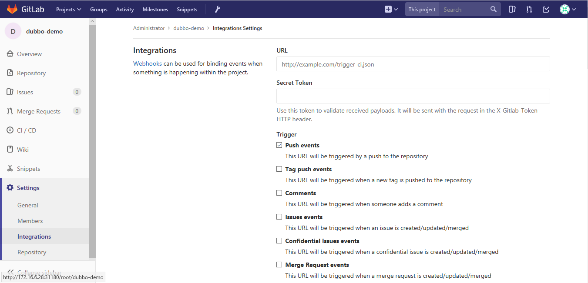
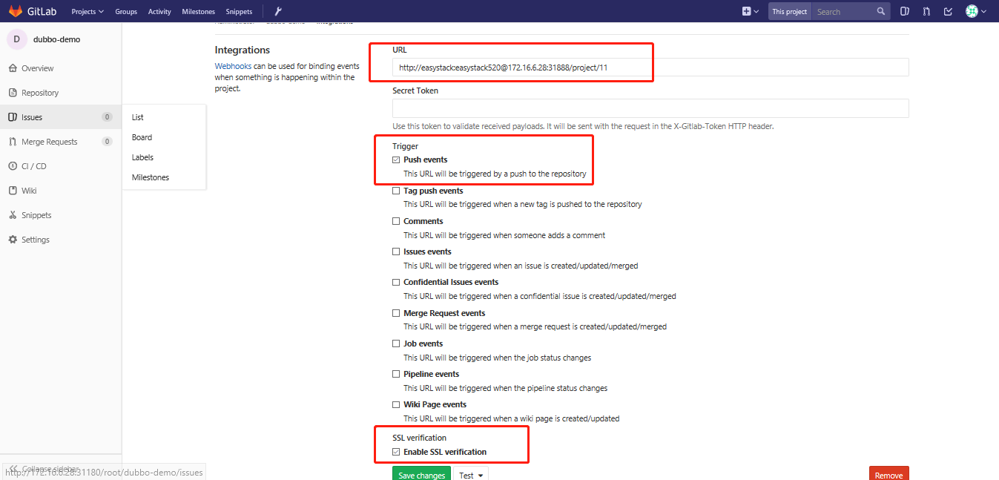
添加成功后，点击此webhook后面的test进行测试
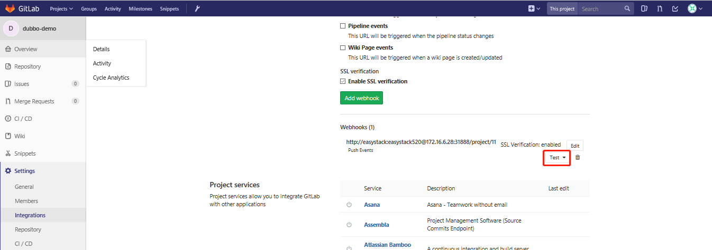
如果返回Hook successfully executed.表示配置成功。

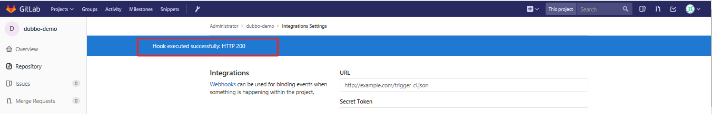

这样，下次push代码后，就会自动触发jenkins上相关的构建工程进行自动发布了！无需人工干预~

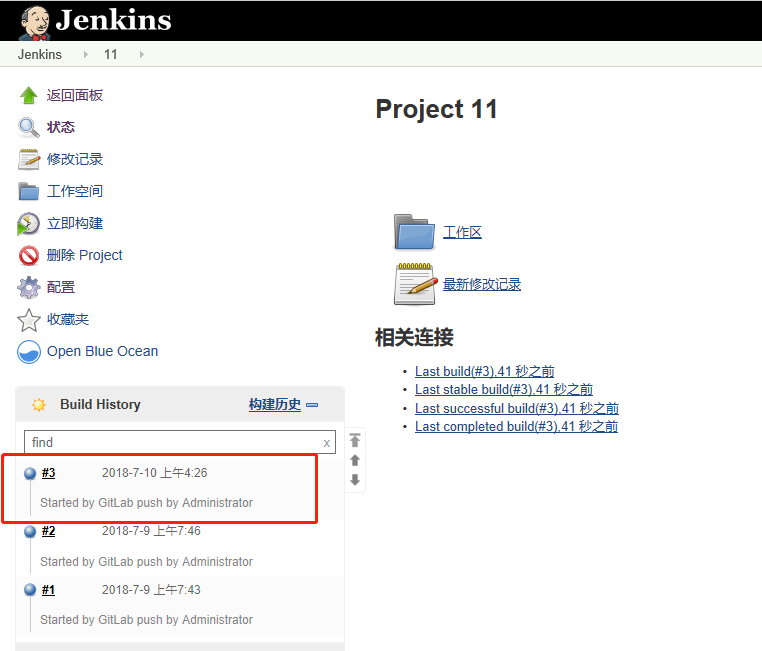

## 创建Jenkins Job，并配置gitlab自动触发
step 1:设置Jenkins 自由风格的项目：
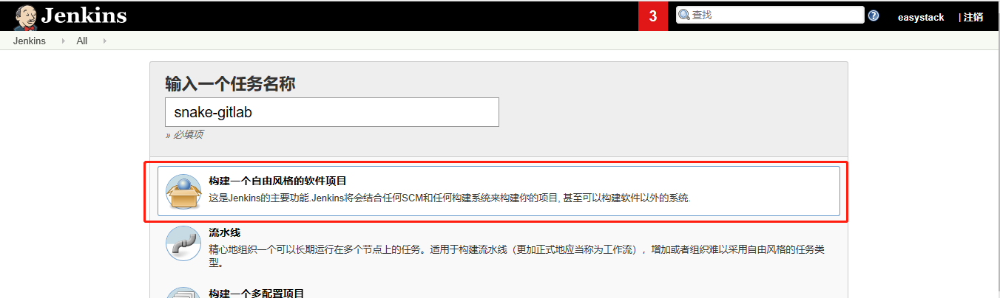
step 2:选择源码管理：先设置代码的git下载路径，这里通过ssh方式（需要提前将Jenkins本机的key添加到Gitlab上）
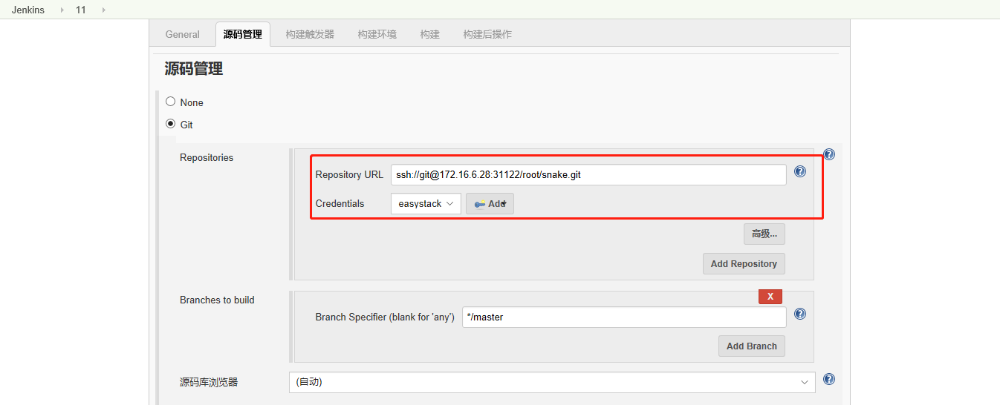
step 3:添加credential:
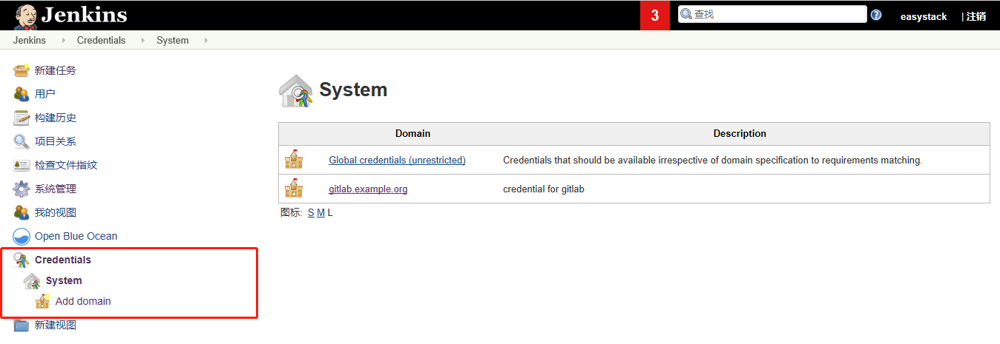

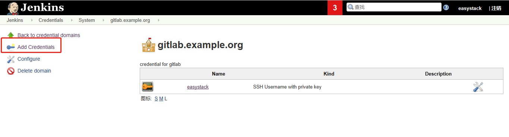
在Jenkins中将credential添加完后，需要将credential中的公钥添加到gitlab中去。

step 3:查看jenkin生成回调地址。在任务重构建触发器下获取回调URL。

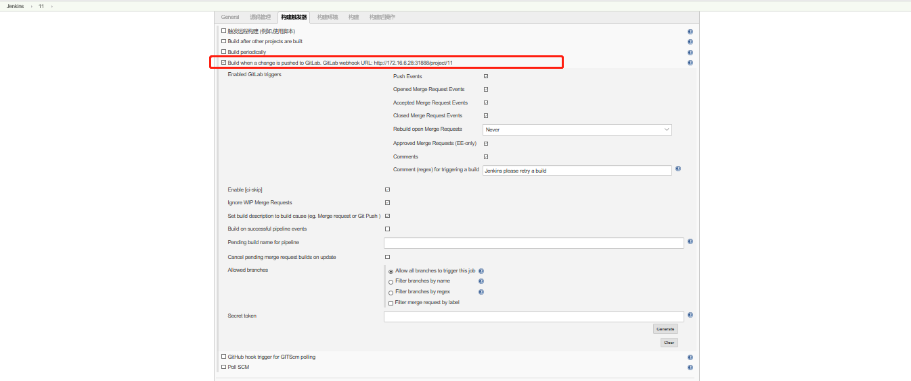

3.2.1 pipeline1:构建snake镜像  
在jenkins master中构建pipieline如下：
```
podTemplate(name: 'jnlp', label: 'jnlp', namesapce: 'default', cloud: 'kubernetes',
  containers: [
        containerTemplate(
            name: 'jnlp',
            image: 'hub.easystack.io/3dc70621b8504c98/jenkins-slave:v1',
            command: '',
            args: '${computer.jnlpmac} ${computer.name}',
            privileged: true,
            alwaysPullImage: false,
            ttyEnabled: true, 
        ),
  ],
  volumes: [hostPathVolume(hostPath: '/var/run/docker.sock', mountPath: '/var/run/docker.sock'),
            hostPathVolume(hostPath: '/usr/bin/docker', mountPath: '/usr/bin/docker'),
            hostPathVolume(hostPath: '/usr/bin/docker-current', mountPath: '/usr/bin/docker-current'),
            hostPathVolume(hostPath: '/etc/sysconfig/docker', mountPath: '/etc/sysconfig/docker'),
            hostPathVolume(hostPath: '/usr/bin/kubectl', mountPath: '/usr/bin/kubectl')]
  ) {

  node('jnlp') {
    stage('devops for snake game') {
        container('jnlp') {
            stage("clone snake code") {
                git 'https://github.com/luluwangwang1989/Snake.git'
            }
            
            stage('unit test') {
                sh 'echo "unit test command"'
            }
            
            stage('build docker image') {
                sh """
                    docker login -u 3dc70621b8504c98 -p Tcdf4f05247d79dd7 hub.easystack.io
                    docker build -t hub.easystack.io/3dc70621b8504c98/snake:${BUILD_NUMBER} .
                    docker push hub.easystack.io/3dc70621b8504c98/snake:${BUILD_NUMBER}
                """
            }
            
            stage('deploy to k8s') {
                
                sh """kubectl set image deployment/snake snake=hub.easystack.io/captain/snake:${BUILD_NUMBER}"""
            }
        }
    }
 }
}
```
其中“  image: 'hub.easystack.io/3dc70621b8504c98/jenkins-slave:v1'”指明我们前面构建的jenkins slave镜像。
“git 'https://github.com/luluwangwang1989/Snake.git'”将snake源码从github上拉取下来。
使用
```
 stage('build docker image') {
                sh """
                    docker login -u 3dc70621b8504c98 -p Tcdf4f05247d79dd7 hub.easystack.io
                    docker build -t hub.easystack.io/3dc70621b8504c98/snake:${BUILD_NUMBER} .
                    docker push hub.easystack.io/3dc70621b8504c98/snake:${BUILD_NUMBER}
                """
            }
```
这几步将snake build成docker 镜像，并push到我们的harbor中去。
 

使用EKS将构建成功的snake镜像进行部署：
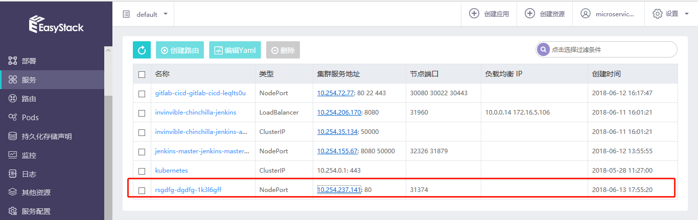

snake部署成功，可以正常访问：
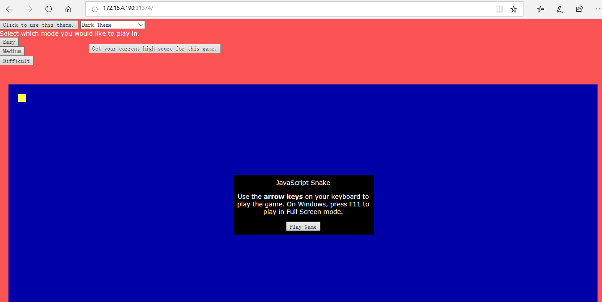

## 使用jenkinsfile来构建jenkins pipeline自动构建：

step 1:
在gitlab中创建project:snake,并拉取源码

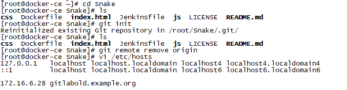

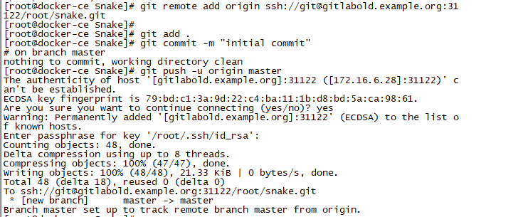

其中snake目录结构以及jenkinsfile如下：
```
[root@docker-ce ~]# cd Snake
[root@docker-ce Snake]# ls
css  Dockerfile  index.html  Jenkinsfile  js  LICENSE  README.md
[root@docker-ce Snake]# cat Jenkinsfile
podTemplate(name: 'jnlp', label: 'jnlp', namesapce: 'default', cloud: 'kubernetes',
  containers: [
        containerTemplate(
            name: 'jnlp',
            image: 'hub.easystack.io/3dc70621b8504c98/jenkins-slave:v1',
            command: '',
            args: '${computer.jnlpmac} ${computer.name}',
            privileged: true,
            alwaysPullImage: false,
            ttyEnabled: true, 
        ),
  ],
  volumes: [hostPathVolume(hostPath: '/var/run/docker.sock', mountPath: '/var/run/docker.sock'),
            hostPathVolume(hostPath: '/usr/bin/docker', mountPath: '/usr/bin/docker'),
            hostPathVolume(hostPath: '/usr/bin/docker-current', mountPath: '/usr/bin/docker-current'),
            hostPathVolume(hostPath: '/etc/sysconfig/docker', mountPath: '/etc/sysconfig/docker'),
            hostPathVolume(hostPath: '/usr/bin/kubectl', mountPath: '/usr/bin/kubectl')]
  ) {

  node('jnlp') {
    stage('devops for snake game') {
        container('jnlp') {
            stage("clone snake code") {
                git 'https://github.com/luluwangwang1989/Snake.git'
            }
            
            stage('unit test') {
                sh 'echo "unit test command"'
            }
            
            stage('build docker image') {
                sh """
                    docker login -u 3dc70621b8504c98 -p Tcdf4f05247d79dd7 hub.easystack.io
                    docker build -t hub.easystack.io/3dc70621b8504c98/snake:${BUILD_NUMBER} .
                    docker push hub.easystack.io/3dc70621b8504c98/snake:${BUILD_NUMBER}
                """
            }
            
            stage('deploy to k8s') {
                
                sh """kubectl set image deployment/snake snake=hub.easystack.io/captain/snake:${BUILD_NUMBER}"""
            }
        }
    }
 }
}
```
在gitlab中设置webhook:


step 2:

在Jenkins创建流水线项目，并设置如下：
1.创建一个pipeline项目
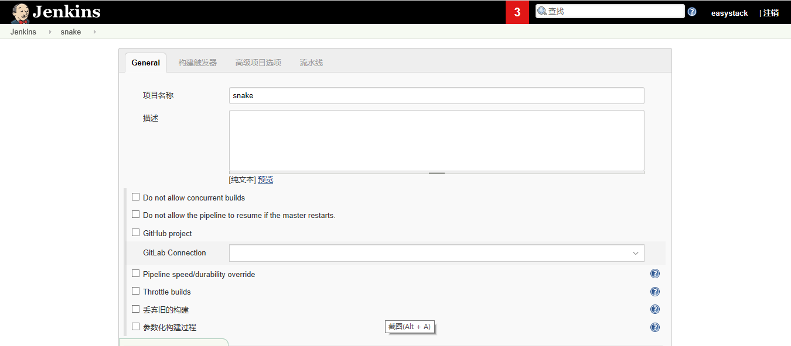
2.对此项目构建触发器
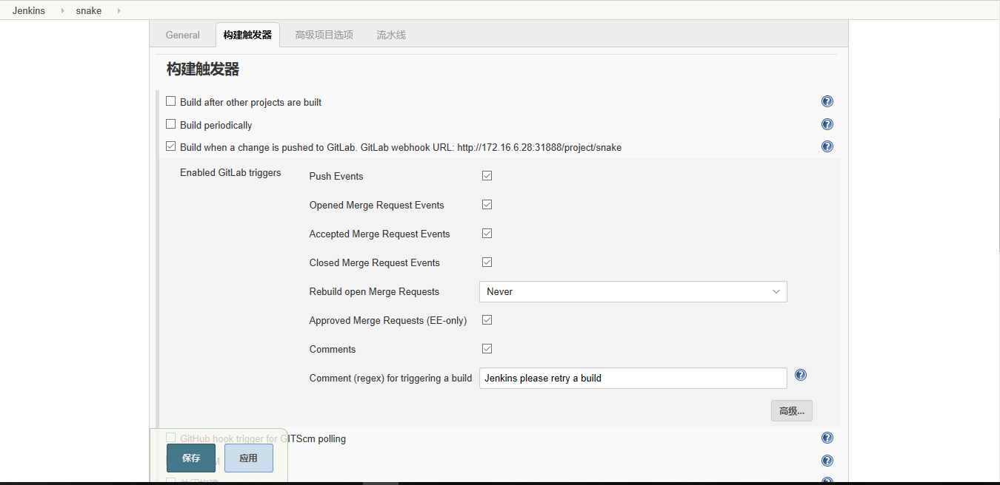
3.在流水线选项中设置git源
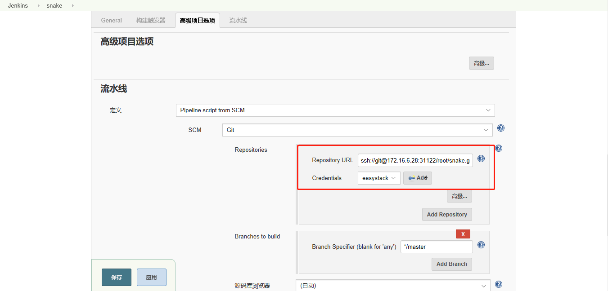

step 3:

在gitlab中修改snake中的文件均会触发Jenkins自动构建snake项目：
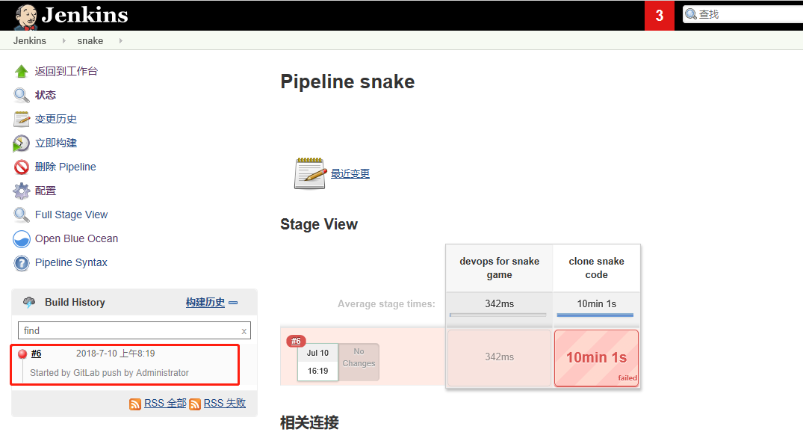

