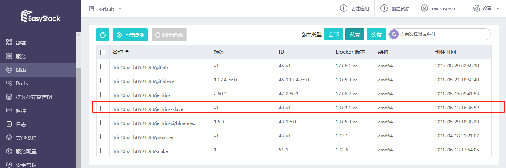
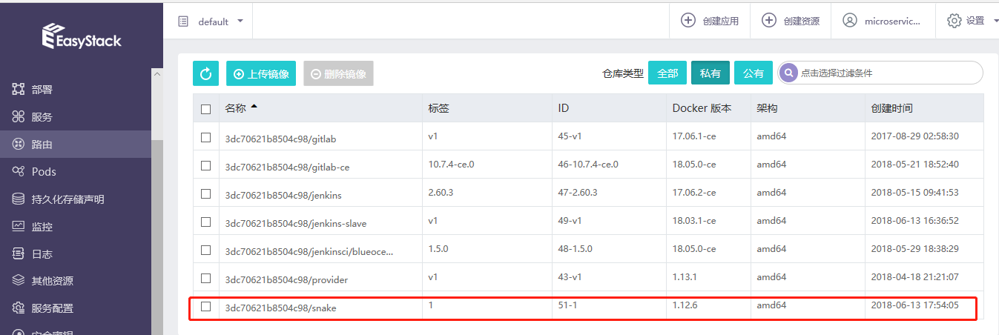

# CI/CD场景实践-JavaScript应用

## 分以下几部分写本部分文档： 1）GitLab中创建项目，并上传代码。 
## 2）Jenkins中的配置；
## 3）GitLab自动触发Jenkins的CI构建的配置。
## 4）CICD结果演示。  

为了完成使用jenkins slave来进行CI工作，需要自己制作一个jenkins slave镜像，并上传到我们的172.16.4.176 harbor中去，自己制作jenkins slave镜像步骤如下：

step 1:使用openshift参考镜像；
step 2:编写Dockefile如下：
```
FROM openshift/jenkins-slave-base-centos7

MAINTAINER Ben Parees <bparees@redhat.com>

ENV MAVEN_VERSION=3.3 \
    GRADLE_VERSION=4.2.1 \
    BASH_ENV=/usr/local/bin/scl_enable \
    ENV=/usr/local/bin/scl_enable \
    PROMPT_COMMAND=". /usr/local/bin/scl_enable" \
    PATH=$PATH:/opt/gradle/bin

# Install Maven
RUN INSTALL_PKGS="java-1.8.0-openjdk-devel.x86_64 rh-maven33*" && \
    x86_EXTRA_RPMS=$(if [ "$(uname -m)" == "x86_64" ]; then echo -n java-1.8.0-openjdk-devel.i686 ; fi) && \
    yum install -y centos-release-scl-rh && \
    yum install -y --enablerepo=centosplus $INSTALL_PKGS $x86_EXTRA_RPMS && \
    curl -LOk https://services.gradle.org/distributions/gradle-${GRADLE_VERSION}-bin.zip && \
    unzip gradle-${GRADLE_VERSION}-bin.zip -d /opt && \
    rm -f gradle-${GRADLE_VERSION}-bin.zip && \
    ln -s /opt/gradle-${GRADLE_VERSION} /opt/gradle && \
    # have temporarily removed the validation for java to work around known problem fixed in fedora; jupierce and gmontero are working with
    # the requisit folks to get that addressed ... will switch back to rpm -V $INSTALL_PKGS when that occurs
    rpm -V  rh-maven33 && \
    yum clean all -y && \
    mkdir -p $HOME/.m2 && \
    mkdir -p $HOME/.gradle

# When bash is started non-interactively, to run a shell script, for example it
# looks for this variable and source the content of this file. This will enable
# the SCL for all scripts without need to do 'scl enable'.
ADD contrib/bin/scl_enable /usr/local/bin/scl_enable
ADD contrib/bin/configure-slave /usr/local/bin/configure-slave
ADD ./contrib/settings.xml $HOME/.m2/
ADD ./contrib/init.gradle $HOME/.gradle/

RUN chown -R 1001:0 $HOME && \
    chmod -R g+rw $HOME

USER 1001
```
step 3: 使用docker build 构建jenkins slave镜像


jenkins slave镜像制作完成后，使用docker push命令将jenkins slave镜像上传到172.16.4.176 harbor中。
镜像制作成功，并上传后，效果如下：

3.2.1 pipeline1:构建snake镜像 (本段删除掉，不需要了)
在jenkins master中构建pipieline如下：
```
podTemplate(name: 'jnlp', label: 'jnlp', namesapce: 'default', cloud: 'kubernetes',
  containers: [
        containerTemplate(
            name: 'jnlp',
            image: 'hub.easystack.io/3dc70621b8504c98/jenkins-slave:v1',
            command: '',
            args: '${computer.jnlpmac} ${computer.name}',
            privileged: true,
            alwaysPullImage: false,
            ttyEnabled: true, 
        ),
  ],
  volumes: [hostPathVolume(hostPath: '/var/run/docker.sock', mountPath: '/var/run/docker.sock'),
            hostPathVolume(hostPath: '/usr/bin/docker', mountPath: '/usr/bin/docker'),
            hostPathVolume(hostPath: '/usr/bin/docker-current', mountPath: '/usr/bin/docker-current'),
            hostPathVolume(hostPath: '/etc/sysconfig/docker', mountPath: '/etc/sysconfig/docker'),
            hostPathVolume(hostPath: '/usr/bin/kubectl', mountPath: '/usr/bin/kubectl')]
  ) {

  node('jnlp') {
    stage('devops for snake game') {
        container('jnlp') {
            stage("clone snake code") {
                git 'https://github.com/luluwangwang1989/Snake.git'
            }
            
            stage('unit test') {
                sh 'echo "unit test command"'
            }
            
            stage('build docker image') {
                sh """
                    docker login -u 3dc70621b8504c98 -p Tcdf4f05247d79dd7 hub.easystack.io
                    docker build -t hub.easystack.io/3dc70621b8504c98/snake:${BUILD_NUMBER} .
                    docker push hub.easystack.io/3dc70621b8504c98/snake:${BUILD_NUMBER}
                """
            }
            
            stage('deploy to k8s') {
                
                sh """kubectl set image deployment/snake snake=hub.easystack.io/captain/snake:${BUILD_NUMBER}"""
            }
        }
    }
 }
}
```
其中“  image: 'hub.easystack.io/3dc70621b8504c98/jenkins-slave:v1'”指明我们前面构建的jenkins slave镜像。
“git 'https://github.com/luluwangwang1989/Snake.git'”将snake源码从github上拉取下来。
使用
```
 stage('build docker image') {
                sh """
                    docker login -u 3dc70621b8504c98 -p Tcdf4f05247d79dd7 hub.easystack.io
                    docker build -t hub.easystack.io/3dc70621b8504c98/snake:${BUILD_NUMBER} .
                    docker push hub.easystack.io/3dc70621b8504c98/snake:${BUILD_NUMBER}
                """
            }
```
这几步将snake build成docker 镜像，并push到我们的harbor中去。

使用EKS将构建成功的snake镜像进行部署：


snake部署成功，可以正常访问：

