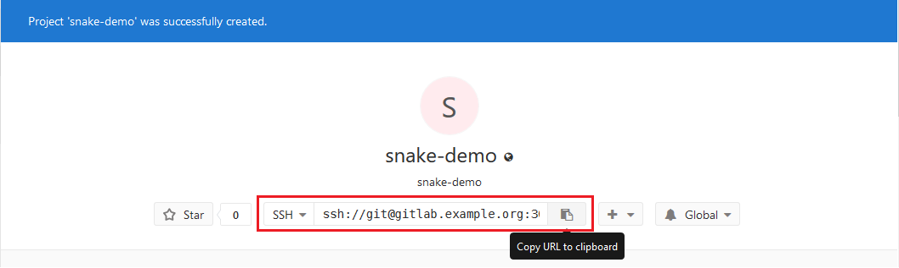
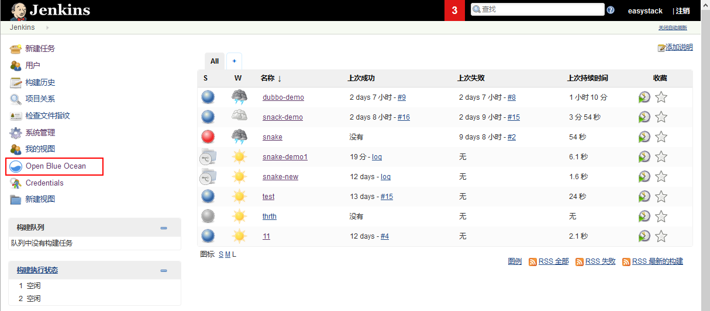
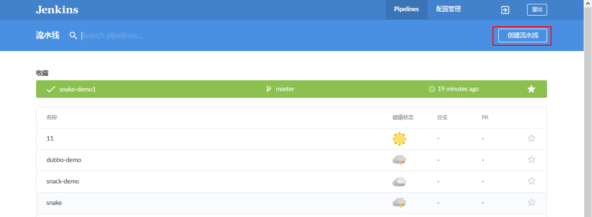
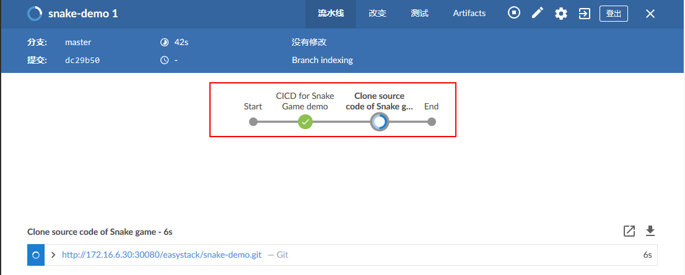
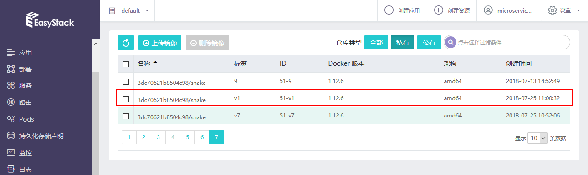
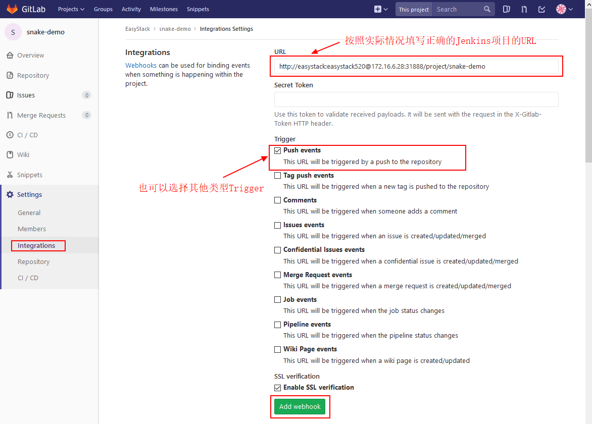
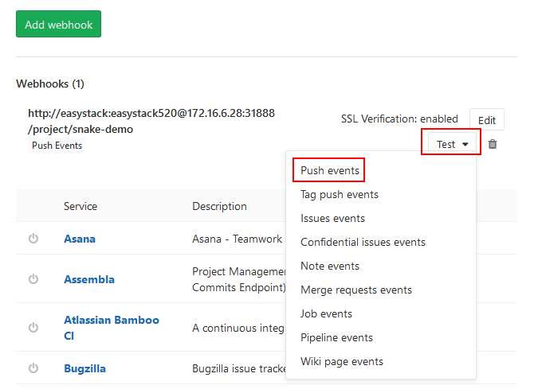

# CI/CD场景实践-JavaScript应用 （Ready） 

本文档主要介绍如何在已完成部署的CI/CD工具链基础上，实现JavaScript应用的CI/CD配置和演示。  

## 1. 在GitLab中创建项目，并上传源代码  

**Step 1: 在GitLab中创建示例项目。**  
在GitLab中创建一个示例项目（Create a project），填入项目名称如“snake-demo”：  
  
  
注：目前只支持Public类型的GitLab项目，还需要研究如何支持Private项目。  

**Step 2: 上传源代码至GitLab示例项目。**  

首先需要确认所使用的本地虚拟机环境（可使用之前上传Docker镜像的环境）中已经安装了Git，并完成Git Global Config配置。   
然后从GitHub上将示例项目的源代码克隆（Clone）到本地虚拟机中：  
```
[root@docker-ce ~]# git clone https://github.com/PabloZhong/Snake.git
```

随后可参考GitLab中界面提示，通过SSH方式将源代码Push到GitLab中：  
（备注：需要提前在运行Git的虚拟机上修改/etc/hosts文件，加入集群节点NodeIP与域名的映射，如本示例加入172.16.6.48 gitlab.example.org）
```
[root@docker-ce ~]# cd Snake/
[root@docker-ce Snake]# git init
[root@docker-ce Snake]# git remote rename origin old-origin 
[root@docker-ce Snake]# git remote add origin ssh://git@gitlab.example.org:30022/easystack/snake-demo.git  
[root@docker-ce Snake]# git push -u origin --all   
```
其中GitLab项目地址参考：  
  

Push成功后即可在GitLab的“snake-demo”项目中看到已上传的源代码：  
  

## 2. 创建Jenkins Pipeline，并部署Snake应用    

**Step 1: 制作Jenkins Slave镜像。**  
为了使用Jenkins Slave来执行Pipeline，首先需要制作Jenkins Slave镜像，并上传至EKS的镜像仓库中。   
具体步骤如下：  

1） 在本地虚拟机Linux环境中，执行：  
```
[root@docker-ce jenkins-slave]# git clone https://github.com/PabloZhong/jenkins-1  
[root@docker-ce jenkins-slave]# cd jenkins-1/slave-base/  
```

可以查看到所需要使用到的Dockerfile如下：  
```
FROM openshift/origin
MAINTAINER Ben Parees <bparees@redhat.com>

ENV HOME=/home/jenkins

USER root
# Install headless Java
RUN yum install -y centos-release-scl-rh && \
    x86_EXTRA_RPMS=$(if [ "$(uname -m)" == "x86_64" ]; then echo -n java-1.8.0-openjdk-headless.i686 ; fi) && \
    INSTALL_PKGS="bc gettext git java-1.8.0-openjdk-headless lsof rsync tar unzip which zip bzip2" && \
    yum install -y --setopt=tsflags=nodocs install $INSTALL_PKGS $x86_EXTRA_RPMS && \
    # have temporarily removed the validation for java to work around known problem fixed in fedora; jupierce and gmontero are working with
    # the requisit folks to get that addressed ... will switch back to rpm -V $INSTALL_PKGS when that occurs
    rpm -V bc gettext git lsof rsync tar unzip which zip bzip2  && \
    yum clean all && \
    mkdir -p /home/jenkins && \
    chown -R 1001:0 /home/jenkins && \
    chmod -R g+w /home/jenkins && \
    chmod 664 /etc/passwd && \
    chmod -R 775 /etc/alternatives && \
    chmod -R 775 /var/lib/alternatives && \
    chmod -R 775 /usr/lib/jvm && \
    chmod 775 /usr/bin && \
    chmod 775 /usr/lib/jvm-exports && \
    chmod 775 /usr/share/man/man1 && \
    chmod 775 /var/lib/origin && \    
    unlink /usr/bin/java && \
    unlink /usr/bin/jjs && \
    unlink /usr/bin/keytool && \
    unlink /usr/bin/orbd && \
    unlink /usr/bin/pack200 && \
    unlink /usr/bin/policytool && \
    unlink /usr/bin/rmid && \
    unlink /usr/bin/rmiregistry && \
    unlink /usr/bin/servertool && \
    unlink /usr/bin/tnameserv && \
    unlink /usr/bin/unpack200 && \
    unlink /usr/lib/jvm-exports/jre && \
    unlink /usr/share/man/man1/java.1.gz && \
    unlink /usr/share/man/man1/jjs.1.gz && \
    unlink /usr/share/man/man1/keytool.1.gz && \
    unlink /usr/share/man/man1/orbd.1.gz && \
    unlink /usr/share/man/man1/pack200.1.gz && \
    unlink /usr/share/man/man1/policytool.1.gz && \
    unlink /usr/share/man/man1/rmid.1.gz && \
    unlink /usr/share/man/man1/rmiregistry.1.gz && \
    unlink /usr/share/man/man1/servertool.1.gz && \
    unlink /usr/share/man/man1/tnameserv.1.gz && \
    unlink /usr/share/man/man1/unpack200.1.gz

# Copy the entrypoint
ADD contrib/bin/* /usr/local/bin/

# Run the Jenkins JNLP client
ENTRYPOINT ["/usr/local/bin/run-jnlp-client"]
```

2）构建Jenkins Slave镜像  
在Dockerfile所在的路径下执行以下命令进行镜像构建： 
```
[root@docker-ce slave-base]# docker build -t jenkins-slave:v1 .
```

3）上传Jenkins Slave镜像  
Jenkins Slave镜像制作完成后，使用docker push命令将Jenkins Slave镜像上传到EKS的镜像仓库中。  
```
[root@docker-ce slave-base]# docker push 172.16.0.176/3dc70621b8504c98/jenkins-slave:v1
```
注：请按需修改镜像仓库地址和用户名。  

上传成功后，可查看已上传的镜像：  
 
后续步骤中会使用这个镜像来执行Jenkins Pipeline。  

**Step 2: 通过Jenkins Blue Ocean创建Jenkins Pipeline。**   
使用Jenkins Blue Ocean能够实现更丰富、更直观的Pipeline功能。  

在Jenkins主界面点击“Open Blue Ocean”进入Blue Ocean操作界面：   
   

点击“创建流水线”：   
   

填入GitLab代码仓库对应的项目地址：（注意：SSH的URL中需要将域名改成NodeIP）   
  

Jenkins将自动生成SSH Key Pair，需要将SSH公钥添加到GitLab中，添加路径为【GitLab】-【User Setting】-【SSH Keys】：  
  

回到Jenkins Blue Ocean界面，点击“创建Pipeline”之后，Jenkins首先将会自动拉取GitLab代码库中的Jenkinsfile，并按照Jenkinsfile执行第一次Pipeline：  
图缺  
  
  

本示例中的Jenkinsfile参考如下：
```
podTemplate(name: 'jnlp', label: 'jnlp', namesapce: 'default', cloud: 'kubernetes',
  containers: [
        containerTemplate(
            name: 'jnlp',
            //请按需修改Jenkins Slave镜像名称
            image: 'hub.easystack.io/3dc70621b8504c98/jenkins-slave:v1',
            command: '',
            args: '${computer.jnlpmac} ${computer.name}',
            privileged: true,
            alwaysPullImage: false,
            ttyEnabled: true, 
        ),
  ],
  volumes: [hostPathVolume(hostPath: '/var/run/docker.sock', mountPath: '/var/run/docker.sock'),
            hostPathVolume(hostPath: '/usr/bin/docker', mountPath: '/usr/bin/docker'),
            hostPathVolume(hostPath: '/usr/bin/docker-current', mountPath: '/usr/bin/docker-current'),
            hostPathVolume(hostPath: '/etc/sysconfig/docker', mountPath: '/etc/sysconfig/docker'),
            hostPathVolume(hostPath: '/usr/bin/kubectl', mountPath: '/usr/bin/kubectl')]
  ) {

  node('jnlp') {
    stage('CICD for Snake Game demo') {
        container('jnlp') {
            stage("Clone source code of Snake game") {
                //请按需修改源代码库地址
                git 'http://172.16.6.30:30080/easystack/snake-demo.git'
            }
                      
            stage('Build & push docker image') {
                //请按需修改镜像仓库的账号和密码
                sh """
                    docker login -u 3dc70621b8504c98 -p Tcdf4f05247d79dd7 hub.easystack.io  
                    docker build -t hub.easystack.io/3dc70621b8504c98/snake:${BUILD_NUMBER} . 
                    docker push hub.easystack.io/3dc70621b8504c98/snake:${BUILD_NUMBER}
                """
            }
            
            //stage('Deploy app to EKS') {
                //请按需修改Deployment名称和Snake镜像名称
                //sh """kubectl set image deployment/snake-snake-e8fluud7 snake-snake-e8fluud7=hub.easystack.io/3dc70621b8504c98/snake:${BUILD_NUMBER}"""
            //}
        }
    }
 }
}
```
其中： 
1）```image: 'hub.easystack.io/3dc70621b8504c98/jenkins-slave:v1'```指定之前所构建的Jenkins Slave镜像。  
2）```git 'http://172.16.6.30:30080/easystack/snake-demo.git'```将Snake Demo源代码从GitLab中拉取下来，注意按需修改源代码项目地址。 
3）下面的命令分别实现登录镜像仓库、构建Snake Demo镜像以及上传镜像：  
```
 stage('Build & push docker image') {
                //请按需修改镜像仓库的账号和密码
                sh """
                    docker login -u 3dc70621b8504c98 -p Tcdf4f05247d79dd7 hub.easystack.io
                    docker build -t hub.easystack.io/3dc70621b8504c98/snake:${BUILD_NUMBER} .
                    docker push hub.easystack.io/3dc70621b8504c98/snake:${BUILD_NUMBER}
                """
            }
``` 

在Blue Ocean界面中可以查看Pipeline执行进度：  
  

在EKS的镜像仓库中查看第一次构建并上传的Snake Demo镜像： 
 

注：按照上面所示的Jenkinsfile执行的Pipeline，第一次构建只会完成Snake Demo镜像构建并上传到EKS镜像仓库，下一步需要手动进行第一次应用部署。  

**Step 3: 在EKS中进行Snake Demo应用的第一次部署。**  
在EKS中，选择第一次执行Pipeline生成的Snake Demo镜像，进行Snake Demo应用部署： 
  
  

部署成功之后，查看对应的服务的端口号：  
  

通过NodeIP:Port方式，访问初次部署的Snake Demo应用，可以发现是一个“贪吃蛇”游戏： 
 
    
请记录Snake Demo应用的部署（Deployment）的名称，后续配置Jenkins自动部署时需要使用。  

## 3. 配置自动部署    

修改Jenkinsfile源代码，增加自动部署。  

修改之后的Jenkinsfile如下：（增加最后的CD部署Stage）  
```
podTemplate(name: 'jnlp', label: 'jnlp', namesapce: 'default', cloud: 'kubernetes',
  containers: [
        containerTemplate(
            name: 'jnlp',
            //请按需修改Jenkins Slave镜像名称
            image: 'hub.easystack.io/3dc70621b8504c98/jenkins-slave:v1',
            command: '',
            args: '${computer.jnlpmac} ${computer.name}',
            privileged: true,
            alwaysPullImage: false,
            ttyEnabled: true, 
        ),
  ],
  volumes: [hostPathVolume(hostPath: '/var/run/docker.sock', mountPath: '/var/run/docker.sock'),
            hostPathVolume(hostPath: '/usr/bin/docker', mountPath: '/usr/bin/docker'),
            hostPathVolume(hostPath: '/usr/bin/docker-current', mountPath: '/usr/bin/docker-current'),
            hostPathVolume(hostPath: '/etc/sysconfig/docker', mountPath: '/etc/sysconfig/docker'),
            hostPathVolume(hostPath: '/usr/bin/kubectl', mountPath: '/usr/bin/kubectl')]
  ) {

  node('jnlp') {
    stage('CICD for Snake Game demo') {
        container('jnlp') {
            stage("Clone source code of Snake game") {
                //请按需修改源代码库地址
                git 'http://172.16.6.30:30080/easystack/snake-demo.git'
            }
                      
            stage('Build & push docker image') {
                //请按需修改镜像仓库的账号和密码
                sh """
                    docker login -u 3dc70621b8504c98 -p Tcdf4f05247d79dd7 hub.easystack.io  
                    docker build -t hub.easystack.io/3dc70621b8504c98/snake:${BUILD_NUMBER} . 
                    docker push hub.easystack.io/3dc70621b8504c98/snake:${BUILD_NUMBER}
                """
            }
            
            stage('Deploy app to EKS') {
                //请按需修改Deployment名称和Snake镜像名称
                sh """kubectl set image deployment/snake-snake-e8fluud7 snake-snake-e8fluud7=hub.easystack.io/3dc70621b8504c98/snake:${BUILD_NUMBER}"""
            }
        }
    }
 }
}
```

## 4. 配置自动触发构建    
为了实现GitLab中更新代码操作能够自动触发Jenkins Pipeline构建，我们需要在GitLab中配置Webhook。     
具体步骤如下：  
在GitLab的项目中选择【Settings】->[Integrations]，构建Webhook：  
   
其中URL需要填写准确，具体的格式可参考：http://<Jenkins user account>:<Jenkins user password>@<NodeIP>:<Jenkins Service NodePort>/project/<Jenkins project name>  

>注：此处选择的触发方式（Trigger）为“Push events”，代表每次Push代码操作都会触发Webhook，您也可以选择其他触发（Trigger）方式，如“Merge Request events”等。  

添加成功后，点击“test”进行测试：   
  

如果返回“Hook executed successfully: HTTP 200 ”即表示Webhook配置成功：
  

后续每次往GitLab的“snake-demo”项目中Push代码后，就会自动触发Jenkins上相对应的Pipeline进行构建，而无需手动启动Jenkins Pipeline。  


## 5. CI/CD效果演示    

在gitlab中修改snake中的文件均会触发Jenkins自动构建Snake Demo项目： 

修改snake代码中食物的颜色，并自动部署新的snake镜像：通过修改snake代码下的css文件中的 main-snake.css中的 

来修改食物的颜色，修改成功后，会自动触发Jenkins Pipeline，执行“代码克隆”->“镜像构建”->“镜像上传”->“自动部署”一整套流程。  

在Jenkins Blue Ocean界面中查看Pipeline执行状态：  


部署完成后，效果如下： 

可以看到，食物的颜色由原来的大红色变为了黄色。至此，完成了修改snake源码自动构建snake镜像，并且自动部署snake服务的CI/CD流程。  
