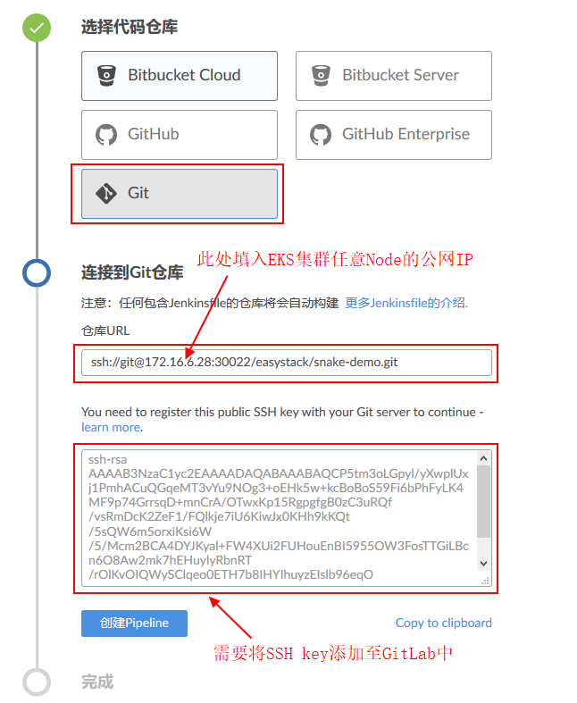
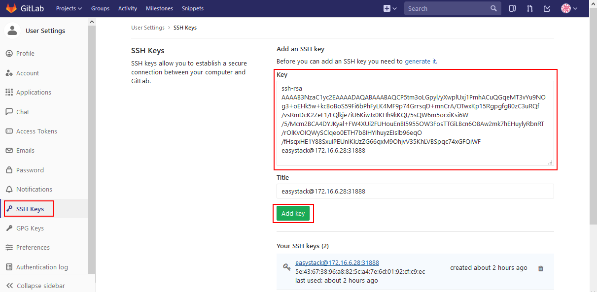

# CI/CD场景实践-JavaScript应用 （待修改） 

## 1. 在GitLab中创建项目，并上传源代码  

**Step 1: 在GitLab中创建示例项目。**  
我们在GitLab中创建一个示例项目（Create a project），名称填入“snake-demo”：  
  
  


**Step 2: 上传示例项目的源代码至GitLab。**  

首先需要确认所使用的本地虚拟机环境（可使用之前上传Docker镜像的环境）中已经安装了Git，并完成Git Global Config配置。   
然后从GitHub上将示例项目的源代码克隆（Clone）到本地虚拟机中：  
```
[root@docker-ce ~]# git clone https://github.com/PabloZhong/Snake.git
```

可参考GitLab中界面提示，通过SSH方式将源代码Push到GitLab中：  
（备注：需要提前在运行Git的虚拟机上修改/etc/hosts文件，加入集群节点NodeIP与域名的映射，如本示例加入172.16.6.48 gitlab.example.org）
```
[root@docker-ce ~]# cd Snake/
[root@docker-ce dubbo]# git init
[root@docker-ce dubbo]# git remote rename origin old-origin 
[root@docker-ce dubbo]# git remote add origin ssh://git@gitlab.example.org:30022/root/snake-demo.git  
[root@docker-ce dubbo]# git push -u origin --all   
```
Push成功后即可在GitLab的“snake-demo”项目中看到已上传的源代码。  

## 2. 创建Jenkins Pipeline，并部署Snake应用    

**Step 1: 制作用于编译Snake源码的Jenkins Slave镜像。**  
为了完成使用jenkins slave来进行CI工作，需要自己制作一个jenkins slave镜像，并上传到EKS的镜像仓库中去，自己制作jenkins slave镜像步骤如下：

Step1: 编写Dockefile如下：（https://github.com/PabloZhong/jenkins-1/tree/master/slave-base） 
```
FROM openshift/origin

MAINTAINER Ben Parees <bparees@redhat.com>

ENV HOME=/home/jenkins

USER root
# Install headless Java
RUN yum install -y centos-release-scl-rh && \
    x86_EXTRA_RPMS=$(if [ "$(uname -m)" == "x86_64" ]; then echo -n java-1.8.0-openjdk-headless.i686 ; fi) && \
    INSTALL_PKGS="bc gettext git java-1.8.0-openjdk-headless lsof rsync tar unzip which zip bzip2" && \
    yum install -y --setopt=tsflags=nodocs install $INSTALL_PKGS $x86_EXTRA_RPMS && \
    # have temporarily removed the validation for java to work around known problem fixed in fedora; jupierce and gmontero are working with
    # the requisit folks to get that addressed ... will switch back to rpm -V $INSTALL_PKGS when that occurs
    rpm -V bc gettext git lsof rsync tar unzip which zip bzip2  && \
    yum clean all && \
    mkdir -p /home/jenkins && \
    chown -R 1001:0 /home/jenkins && \
    chmod -R g+w /home/jenkins && \
    chmod 664 /etc/passwd && \
    chmod -R 775 /etc/alternatives && \
    chmod -R 775 /var/lib/alternatives && \
    chmod -R 775 /usr/lib/jvm && \
    chmod 775 /usr/bin && \
    chmod 775 /usr/lib/jvm-exports && \
    chmod 775 /usr/share/man/man1 && \
    chmod 775 /var/lib/origin && \    
    unlink /usr/bin/java && \
    unlink /usr/bin/jjs && \
    unlink /usr/bin/keytool && \
    unlink /usr/bin/orbd && \
    unlink /usr/bin/pack200 && \
    unlink /usr/bin/policytool && \
    unlink /usr/bin/rmid && \
    unlink /usr/bin/rmiregistry && \
    unlink /usr/bin/servertool && \
    unlink /usr/bin/tnameserv && \
    unlink /usr/bin/unpack200 && \
    unlink /usr/lib/jvm-exports/jre && \
    unlink /usr/share/man/man1/java.1.gz && \
    unlink /usr/share/man/man1/jjs.1.gz && \
    unlink /usr/share/man/man1/keytool.1.gz && \
    unlink /usr/share/man/man1/orbd.1.gz && \
    unlink /usr/share/man/man1/pack200.1.gz && \
    unlink /usr/share/man/man1/policytool.1.gz && \
    unlink /usr/share/man/man1/rmid.1.gz && \
    unlink /usr/share/man/man1/rmiregistry.1.gz && \
    unlink /usr/share/man/man1/servertool.1.gz && \
    unlink /usr/share/man/man1/tnameserv.1.gz && \
    unlink /usr/share/man/man1/unpack200.1.gz

# Copy the entrypoint
ADD contrib/bin/* /usr/local/bin/

# Run the Jenkins JNLP client
ENTRYPOINT ["/usr/local/bin/run-jnlp-client"]
```
Step 2: 构建Jenkins slave镜像  

在Dockerfile所在的路径下执行以下命令进行镜像构建：
```
[root@docker-ce jenkins-slave]# docker build -t jenkins-slave:v1 .
```

Jenkins Slave镜像制作完成后，使用docker push命令将Jenkins Slave镜像上传到EKS的镜像仓库中。  
```
[root@docker-ce jenkins-slave]# docker push 172.16.0.176/3dc70621b8504c98/jenkins-slave:v1
```
镜像制作成功，并上传后，可查看已上传的镜像如下： 
 
后续步骤中会使用上面的镜像进行源代码编译。  

**Step 2: 通过Blue Ocean创建Jenkins Pipeline。**  

进入BlueOcean：  
   

创建流水线Pipeline：  
   
  
  


**Step 3: 配置Webhook。**   （挪到已经创建好jenkins项目之后去）  

在GitLab的项目中选择【Settings】->[Integrations]，构建webhook


添加成功后，点击此webhook后面的test进行测试

如果返回Hook successfully executed.表示配置成功。


这样，下次push代码后，就会自动触发jenkins上相关的构建工程进行自动发布了！无需人工干预~


## Gitlab创建project,并配置webhook
step 1:在gitlab的项目中选择[setting]->[Integrations]，构建webhook


添加成功后，点击此webhook后面的test进行测试

如果返回Hook successfully executed.表示配置成功。


这样，下次push代码后，就会自动触发jenkins上相关的构建工程进行自动发布了！无需人工干预~


**下面这个自由风格的项目，废弃不用**  
## 创建Jenkins Job，并配置gitlab自动触发
step 1:设置Jenkins 自由风格的项目：

step 2:选择源码管理：先设置代码的git下载路径，这里通过ssh方式（需要提前将Jenkins本机的key添加到Gitlab上）

step 3:添加credential:


在Jenkins中将credential添加完后，需要将credential中的公钥添加到gitlab中去。

step 3:查看jenkin生成回调地址。在任务重构建触发器下获取回调URL。


3.2.1 pipeline1:构建snake镜像  
在jenkins master中构建pipieline如下：
```
podTemplate(name: 'jnlp', label: 'jnlp', namesapce: 'default', cloud: 'kubernetes',
  containers: [
        containerTemplate(
            name: 'jnlp',
            image: 'hub.easystack.io/3dc70621b8504c98/jenkins-slave:v1',
            command: '',
            args: '${computer.jnlpmac} ${computer.name}',
            privileged: true,
            alwaysPullImage: false,
            ttyEnabled: true, 
        ),
  ],
  volumes: [hostPathVolume(hostPath: '/var/run/docker.sock', mountPath: '/var/run/docker.sock'),
            hostPathVolume(hostPath: '/usr/bin/docker', mountPath: '/usr/bin/docker'),
            hostPathVolume(hostPath: '/usr/bin/docker-current', mountPath: '/usr/bin/docker-current'),
            hostPathVolume(hostPath: '/etc/sysconfig/docker', mountPath: '/etc/sysconfig/docker'),
            hostPathVolume(hostPath: '/usr/bin/kubectl', mountPath: '/usr/bin/kubectl')]
  ) {

  node('jnlp') {
    stage('devops for snake game') {
        container('jnlp') {
            stage("clone snake code") {
                git 'https://github.com/luluwangwang1989/Snake.git'
            }
            
            stage('unit test') {
                sh 'echo "unit test command"'
            }
            
            stage('build docker image') {
                sh """
                    docker login -u 3dc70621b8504c98 -p Tcdf4f05247d79dd7 hub.easystack.io
                    docker build -t hub.easystack.io/3dc70621b8504c98/snake:${BUILD_NUMBER} .
                    docker push hub.easystack.io/3dc70621b8504c98/snake:${BUILD_NUMBER}
                """
            }
            
            stage('deploy to k8s') {
                
                sh """kubectl set image deployment/snake snake=hub.easystack.io/captain/snake:${BUILD_NUMBER}"""
            }
        }
    }
 }
}
```
其中“  image: 'hub.easystack.io/3dc70621b8504c98/jenkins-slave:v1'”指明我们前面构建的jenkins slave镜像。
“git 'https://github.com/luluwangwang1989/Snake.git'”将snake源码从github上拉取下来。
使用
```
 stage('build docker image') {
                sh """
                    docker login -u 3dc70621b8504c98 -p Tcdf4f05247d79dd7 hub.easystack.io
                    docker build -t hub.easystack.io/3dc70621b8504c98/snake:${BUILD_NUMBER} .
                    docker push hub.easystack.io/3dc70621b8504c98/snake:${BUILD_NUMBER}
                """
            }
```
这几步将snake build成docker 镜像，并push到我们的harbor中去。
 

使用EKS将构建成功的snake镜像进行部署：


snake部署成功，可以正常访问：


**下面这个Jenkins 传统节目创建pipeline的项目，废弃不用**  
## 使用jenkinsfile来构建jenkins pipeline自动构建：

step 1:
在gitlab中创建project:snake,并拉取源码


其中snake目录结构以及jenkinsfile如下：
```
[root@docker-ce ~]# cd Snake
[root@docker-ce Snake]# ls
css  Dockerfile  index.html  Jenkinsfile  js  LICENSE  README.md
[root@docker-ce Snake]# cat Jenkinsfile
podTemplate(name: 'jnlp', label: 'jnlp', namesapce: 'default', cloud: 'kubernetes',
  containers: [
        containerTemplate(
            name: 'jnlp',
            image: 'hub.easystack.io/3dc70621b8504c98/jenkins-slave:v1',
            command: '',
            args: '${computer.jnlpmac} ${computer.name}',
            privileged: true,
            alwaysPullImage: false,
            ttyEnabled: true, 
        ),
  ],
  volumes: [hostPathVolume(hostPath: '/var/run/docker.sock', mountPath: '/var/run/docker.sock'),
            hostPathVolume(hostPath: '/usr/bin/docker', mountPath: '/usr/bin/docker'),
            hostPathVolume(hostPath: '/usr/bin/docker-current', mountPath: '/usr/bin/docker-current'),
            hostPathVolume(hostPath: '/etc/sysconfig/docker', mountPath: '/etc/sysconfig/docker'),
            hostPathVolume(hostPath: '/usr/bin/kubectl', mountPath: '/usr/bin/kubectl')]
  ) {

  node('jnlp') {
    stage('devops for snake game') {
        container('jnlp') {
            stage("clone snake code") {
                 git 'http://172.16.6.30:30080/easystack/snack-demo.git'
            }
            
            stage('unit test') {
                sh 'echo "unit test command"'
            }
            
            stage('build docker image') {
                sh """
                    docker login -u 3dc70621b8504c98 -p Tcdf4f05247d79dd7 hub.easystack.io
                    docker build -t hub.easystack.io/3dc70621b8504c98/snake:${BUILD_NUMBER} .
                    docker push hub.easystack.io/3dc70621b8504c98/snake:${BUILD_NUMBER}
                """
            }
            
            stage('deploy to k8s') {
                
                sh """kubectl set image deployment/snake snake=hub.easystack.io/captain/snake:${BUILD_NUMBER}"""
            }
        }
    }
 }
}
```
在gitlab中设置webhook:


step 2:

在Jenkins创建流水线项目，并设置如下：
1.创建一个pipeline项目

2.对此项目构建触发器

3.在流水线选项中设置git源


step 3:

在gitlab中修改snake中的文件均会触发Jenkins自动构建snake项目：


构建中控制台输出如下：


在Jenkins的blueocean中查看pipeline


snake镜像构建完成后，在EKS平台部署snake应用：


部署成功后，就可以玩snake游戏啦


step 4:

修改snake代码中食物的颜色，并自动部署新的snake镜像：通过修改snake代码下的css文件中的 main-snake.css中的

来修改食物的颜色，修改成功后，Jenkinsfile中的命令：
```
 stage('deploy to k8s') {


                sh """kubectl set image deployment/snake-snake-e8fluud7 snake-snake-e8fluud7=hub.easystack.io/3dc70621b8504c98/snake:${BUILD_NUMBER}"""

            }


```
会修改部署中的镜像，会将snake服务使用新的镜像重新部署。部署完成后，效果如下：

可以看到，食物的颜色由原来的大红色变为了黄色。至此，完成了修改snake源码自动构建snake镜像，并且自动部署snake服务的CICD流程

