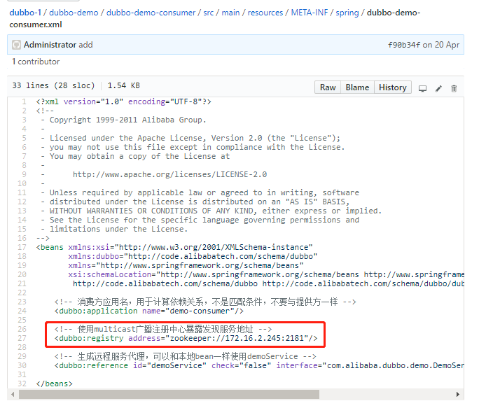

# CICD场景实践  

为了完成使用jenkins slave来进行CI工作，需要自己制作一个jenkins slave镜像，并上传到我们的172.16.4.176 harbor中去，自己制作jenkins slave镜像步骤如下：

step 1:使用openshift参考镜像；
step 2:编写Dockefile如下：
```
FROM openshift/jenkins-slave-base-centos7

MAINTAINER Ben Parees <bparees@redhat.com>

ENV MAVEN_VERSION=3.3 \
    GRADLE_VERSION=4.2.1 \
    BASH_ENV=/usr/local/bin/scl_enable \
    ENV=/usr/local/bin/scl_enable \
    PROMPT_COMMAND=". /usr/local/bin/scl_enable" \
    PATH=$PATH:/opt/gradle/bin

# Install Maven
RUN INSTALL_PKGS="java-1.8.0-openjdk-devel.x86_64 rh-maven33*" && \
    x86_EXTRA_RPMS=$(if [ "$(uname -m)" == "x86_64" ]; then echo -n java-1.8.0-openjdk-devel.i686 ; fi) && \
    yum install -y centos-release-scl-rh && \
    yum install -y --enablerepo=centosplus $INSTALL_PKGS $x86_EXTRA_RPMS && \
    curl -LOk https://services.gradle.org/distributions/gradle-${GRADLE_VERSION}-bin.zip && \
    unzip gradle-${GRADLE_VERSION}-bin.zip -d /opt && \
    rm -f gradle-${GRADLE_VERSION}-bin.zip && \
    ln -s /opt/gradle-${GRADLE_VERSION} /opt/gradle && \
    # have temporarily removed the validation for java to work around known problem fixed in fedora; jupierce and gmontero are working with
    # the requisit folks to get that addressed ... will switch back to rpm -V $INSTALL_PKGS when that occurs
    rpm -V  rh-maven33 && \
    yum clean all -y && \
    mkdir -p $HOME/.m2 && \
    mkdir -p $HOME/.gradle

# When bash is started non-interactively, to run a shell script, for example it
# looks for this variable and source the content of this file. This will enable
# the SCL for all scripts without need to do 'scl enable'.
ADD contrib/bin/scl_enable /usr/local/bin/scl_enable
ADD contrib/bin/configure-slave /usr/local/bin/configure-slave
ADD ./contrib/settings.xml $HOME/.m2/
ADD ./contrib/init.gradle $HOME/.gradle/

RUN chown -R 1001:0 $HOME && \
    chmod -R g+rw $HOME

USER 1001
```
step 3: 使用docker build 构建jenkins slave镜像


jenkins slave镜像制作完成后，使用docker push命令将jenkins slave镜像上传到172.16.4.176 harbor中。
镜像制作成功，并上传后，效果如下：

3.2.1 pipeline1:构建snake镜像 (本段删除掉，不需要了)
在jenkins master中构建pipieline如下：
```
podTemplate(name: 'jnlp', label: 'jnlp', namesapce: 'default', cloud: 'kubernetes',
  containers: [
        containerTemplate(
            name: 'jnlp',
            image: 'hub.easystack.io/3dc70621b8504c98/jenkins-slave:v1',
            command: '',
            args: '${computer.jnlpmac} ${computer.name}',
            privileged: true,
            alwaysPullImage: false,
            ttyEnabled: true, 
        ),
  ],
  volumes: [hostPathVolume(hostPath: '/var/run/docker.sock', mountPath: '/var/run/docker.sock'),
            hostPathVolume(hostPath: '/usr/bin/docker', mountPath: '/usr/bin/docker'),
            hostPathVolume(hostPath: '/usr/bin/docker-current', mountPath: '/usr/bin/docker-current'),
            hostPathVolume(hostPath: '/etc/sysconfig/docker', mountPath: '/etc/sysconfig/docker'),
            hostPathVolume(hostPath: '/usr/bin/kubectl', mountPath: '/usr/bin/kubectl')]
  ) {

  node('jnlp') {
    stage('devops for snake game') {
        container('jnlp') {
            stage("clone snake code") {
                git 'https://github.com/luluwangwang1989/Snake.git'
            }
            
            stage('unit test') {
                sh 'echo "unit test command"'
            }
            
            stage('build docker image') {
                sh """
                    docker login -u 3dc70621b8504c98 -p Tcdf4f05247d79dd7 hub.easystack.io
                    docker build -t hub.easystack.io/3dc70621b8504c98/snake:${BUILD_NUMBER} .
                    docker push hub.easystack.io/3dc70621b8504c98/snake:${BUILD_NUMBER}
                """
            }
            
            stage('deploy to k8s') {
                
                sh """kubectl set image deployment/snake snake=hub.easystack.io/captain/snake:${BUILD_NUMBER}"""
            }
        }
    }
 }
}
```
其中“  image: 'hub.easystack.io/3dc70621b8504c98/jenkins-slave:v1'”指明我们前面构建的jenkins slave镜像。
“git 'https://github.com/luluwangwang1989/Snake.git'”将snake源码从github上拉取下来。
使用
```
 stage('build docker image') {
                sh """
                    docker login -u 3dc70621b8504c98 -p Tcdf4f05247d79dd7 hub.easystack.io
                    docker build -t hub.easystack.io/3dc70621b8504c98/snake:${BUILD_NUMBER} .
                    docker push hub.easystack.io/3dc70621b8504c98/snake:${BUILD_NUMBER}
                """
            }
```
这几步将snake build成docker 镜像，并push到我们的harbor中去。

使用EKS将构建成功的snake镜像进行部署：


snake部署成功，可以正常访问：


3.2.2 构建dubbo镜像
使用以下pipeline script构建dubbo镜像：

```
podTemplate(name: 'jnlp', label: 'jnlp', namespace: 'default', cloud: 'kubernetes',
  containers: [
        containerTemplate(
            name: 'jnlp',
            image: 'hub.easystack.io/3dc70621b8504c98/jenkins-slave-maven:latest',
            command: '',
            args: '${computer.jnlpmac} ${computer.name}',
            privileged: true,
            alwaysPullImage: false,
            ttyEnabled: true, 
        ),
  ],
  volumes: [hostPathVolume(hostPath: '/var/run/docker.sock', mountPath: '/var/run/docker.sock'),
            hostPathVolume(hostPath: '/usr/bin/docker', mountPath: '/usr/bin/docker'),
            hostPathVolume(hostPath: '/usr/bin/docker-current', mountPath: '/usr/bin/docker-current'),
            hostPathVolume(hostPath: '/etc/sysconfig/docker', mountPath: '/etc/sysconfig/docker'),
            hostPathVolume(hostPath: '/usr/bin/kubectl', mountPath: '/usr/bin/kubectl')]
  ) {

  node('jnlp') {
    stage('devops for dubbo') {
        container('jnlp') {
            stage("clone dubbo code") {
                git 'https://github.com/PabloZhong/dubbo-1.git'
            }
            stage('compile') {
                
            
                echo 'Hello, Maven'
                sleep 10
                sh 'java -version'
                dir('/home/jenkins/workspace/dubbo-old/dubbo-demo')
                {
                
                sh '/opt/rh/rh-maven33/root/usr/bin/mvn clean install'
                }

            }
            
            stage('build docker image') {
                sh """
                    docker login -u 3dc70621b8504c98 -p Tcdf4f05247d79dd7 hub.easystack.io
                    
                    docker build -t hub.easystack.io/3dc70621b8504c98/dubbo-consumer:v11 /home/jenkins/workspace/dubbo-old/dubbo-demo/dubbo-demo-consumer
                    
                    docker push hub.easystack.io/3dc70621b8504c98/dubbo-consumer:v11
                                
                    docker build -t hub.easystack.io/3dc70621b8504c98/dubbo-provider:v11 /home/jenkins/workspace/dubbo-old/dubbo-demo/dubbo-demo-provider
                    
                    docker push hub.easystack.io/3dc70621b8504c98/dubbo-provider:v11

                    
                """
            }
            
        }
    }
 }
}
```
使用“image: 'hub.easystack.io/3dc70621b8504c98/jenkins-slave-maven:latest'”镜像作为jenkins的slave镜像， 
使用“git 'https://github.com/PabloZhong/dubbo-1.git'”拉取dubbo源码，使用“mvn clean install”编译dubbo代码，生成jar包。

使用“docker build -t hub.easystack.io/3dc70621b8504c98/dubbo-consumer:v11 /home/jenkins/workspace/dubbo-old/dubbo-demo/dubbo-demo-consumer”命令构建dubbo-consumer容器镜像，

使用“docker build -t hub.easystack.io/3dc70621b8504c98/dubbo-provider:v11 /home/jenkins/workspace/dubbo-old/dubbo-demo/dubbo-demo-provider”构建dubbo-provider容器镜像，
并通过“docker push”命令推送到镜像仓库中去。
其中dubbo-consumer的Dockefile文件如下：
```
FROM openjdk:8-jre
ADD target/dubbo-demo-consumer-2.5.7-assembly.tar.gz /dubbo
COPY start-docker.sh /dubbo/dubbo-demo-consumer-2.5.7/bin/

CMD ["sh","-c","/dubbo/dubbo-demo-consumer-2.5.7/bin/start-docker.sh"]

```
dubbo-provider的Dockfile文件如下：
```
FROM openjdk:8-jre
ADD target/dubbo-demo-provider-2.5.7-assembly.tar.gz /dubbo
COPY start-docker.sh /dubbo/dubbo-demo-provider-2.5.7/bin/

CMD ["sh","-c","/dubbo/dubbo-demo-provider-2.5.7/bin/start-docker.sh"]

```
在此要注意，需要修改dubbo源码路径下的dubbo-demo-consumer.xml和dubbo-demo-provider.xml文件中的zookeeper地址



dubbo-consumer,dubbo-provider镜像成功构建并且推送到镜像仓库后，下一步要通过ECS和EKS部署使用dubbo。
3.3 在ECS+EKS环境里面将dubbo应用落地


在该场景里面采用ECS里面的大数据组件来实现zookeeper集群的快速部署，提供dubbo应用架构的服务注册中心，采用EKS来部署dubbo应用，dubbo应用分为两类，一类是提供服务的provider，另一类是消费服务的consumer，两类服务均采用容器部署的方式部署，部署步骤如下：
**Step 1 - 部署zookeeper集群作为dubbo应用中的注册中心**
1.创建zookeeper网络


2.创建zookeeper集群


**Step 2 - 部署dubbo应用**

1.创建应用依赖配置文件
```
dubbo.properties
[escore@ci-akyzklrim5-0-vsx3xunzxan2-kube-master-gko2lwdxza5r opt]$ cat dubbo.properties 
dubbo.container=log4j,spring
dubbo.application.name=demo-provider
dubbo.application.owner=
dubbo.registry.address=zookeeper://172.16.4.123:2181?backup=172.16.4.122:2181,172.16.4.124:2181
dubbo.monitor.protocol=registry
dubbo.protocol.name=dubbo
dubbo.protocol.port=20880
dubbo.service.loadbalance=roundrobin
dubbo.log4j.file=logs/dubbo-demo-provider.log
dubbo.log4j.level=WARN

```
2、创建应用依赖configmap

```
kubectl create configmap dubbo-config --from-file=dubbo.properties
```
3.在EKS环境里面部署dubbo-provider和dubbo-consumer应用


部署成功后，查看应用运行情况：


**场景 1 - 查看服务调用效果**

1.查看运行pod


2.查看服务注册情况
登陆zookeeper集群：


3.查看服务注册情况：


从以上四步，我们可以看出provider服务在注册中心（zookeeper集群）注册成功，同时consumer调用成功，说明我们可以将dubbo场景下的微服务在ECS+EKS下落地。


