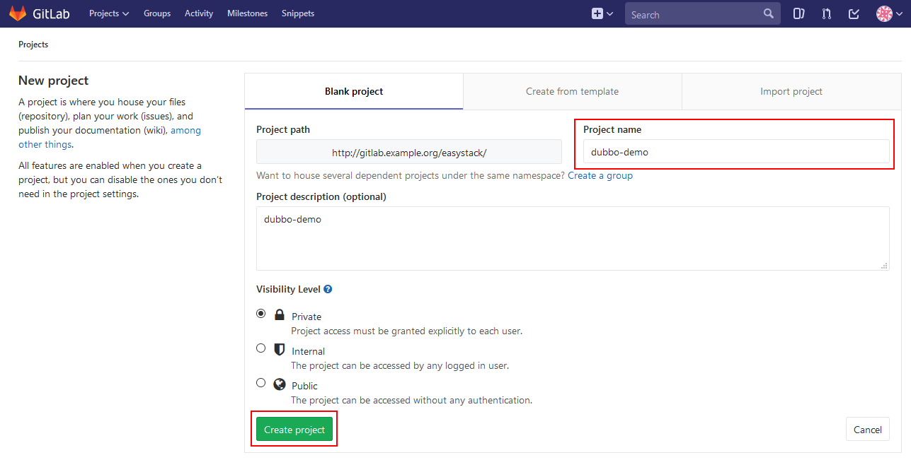

# CI/CD场景实践-Dubbo微服务应用  （待修改） 

## 需要分以下几部分，来修改本部分文档：  
## 1）GitLab中创建项目，并上传代码。 
## 2）Jenkins中的流水线配置，包括GitLab自动触发Jenkins的CI构建的配置。
## 3）CICD场景如何进行演示。  

**Step 1: 在GitLab中创建示例项目。** 

在GitLab中创建一个示例项目“dubbo-demo”：  
  
 

**Step 2: 上传dubbo项目代码以及pom等文件到Gitlab项目中**

首先需要确认所使用的本地虚拟机环境中已经安装了Git，并完成Git Global Config配置。   
然后从GitHub上将示例项目的源代码克隆（Clone）到本地虚拟机中：  
```
[root@docker-ce ~]# git clone https://github.com/PabloZhong/dubbo-demo.git
```
可参考GitLab中界面提示，通过SSH方式进行源代码Push：  
```
[root@docker-ce ~]# cd dubbo/
[root@docker-ce dubbo]# rm -rf .git
[root@docker-ce dubbo]# git init  
[root@docker-ce dubbo]# git remote add origin ssh://git@gitlab.example.org:30022/easystack/dubbo-demo.git  
[root@docker-ce dubbo]# git add .  
[root@docker-ce dubbo]# git commit -m "Initial commit"  
[root@docker-ce dubbo]# git push -u origin master  
```

备注：需要在运行git命令的本机上修改hosts文件，加入IP gitlab.example.org这行

Push成功后即可在GitLab的“dubbo-demo”项目中看到已上传的源代码。  

**Step 6: 修改Dubbo源代码配置文件。** 

（1）dubbo/dubbo-demo/dubbo-demo-consumer/src/main/assembly/conf/dubbo.properties

dubbo.registry.address=zookeeper://172.16.2.245:2181

（2）dubbo/dubbo-demo/dubbo-demo-provider/src/main/assembly/conf/dubbo.properties
dubbo.registry.address=zookeeper://172.16.2.245:2181

其中dubbo.registry.address的地址是创建的zookeeper的地址。

3.2.2 构建dubbo镜像
使用以下pipeline script构建dubbo镜像：

```
podTemplate(name: 'jnlp', label: 'jnlp', namespace: 'default', cloud: 'kubernetes',
  containers: [
        containerTemplate(
            name: 'jnlp',
            image: 'hub.easystack.io/3dc70621b8504c98/jenkins-slave-maven:latest',
            command: '',
            args: '${computer.jnlpmac} ${computer.name}',
            privileged: true,
            alwaysPullImage: false,
            ttyEnabled: true, 
        ),
  ],
  volumes: [hostPathVolume(hostPath: '/var/run/docker.sock', mountPath: '/var/run/docker.sock'),
            hostPathVolume(hostPath: '/usr/bin/docker', mountPath: '/usr/bin/docker'),
            hostPathVolume(hostPath: '/usr/bin/docker-current', mountPath: '/usr/bin/docker-current'),
            hostPathVolume(hostPath: '/etc/sysconfig/docker', mountPath: '/etc/sysconfig/docker'),
            hostPathVolume(hostPath: '/usr/bin/kubectl', mountPath: '/usr/bin/kubectl')]
  ) {

  node('jnlp') {
    stage('devops for dubbo') {
        container('jnlp') {
            stage("clone dubbo code") {
                git 'https://github.com/PabloZhong/dubbo-1.git'
            }
            stage('compile') {
                
            
                echo 'Hello, Maven'
                sleep 10
                sh 'java -version'
                dir('/home/jenkins/workspace/dubbo-old/dubbo-demo')
                {
                
                sh '/opt/rh/rh-maven33/root/usr/bin/mvn clean install'
                }

            }
            
            stage('build docker image') {
                sh """
                    docker login -u 3dc70621b8504c98 -p Tcdf4f05247d79dd7 hub.easystack.io
                    
                    docker build -t hub.easystack.io/3dc70621b8504c98/dubbo-consumer:v11 /home/jenkins/workspace/dubbo-old/dubbo-demo/dubbo-demo-consumer
                    
                    docker push hub.easystack.io/3dc70621b8504c98/dubbo-consumer:v11
                                
                    docker build -t hub.easystack.io/3dc70621b8504c98/dubbo-provider:v11 /home/jenkins/workspace/dubbo-old/dubbo-demo/dubbo-demo-provider
                    
                    docker push hub.easystack.io/3dc70621b8504c98/dubbo-provider:v11

                    
                """
            }
            
        }
    }
 }
}
```
使用“image: 'hub.easystack.io/3dc70621b8504c98/jenkins-slave-maven:latest'”镜像作为jenkins的slave镜像， 
使用“git 'https://github.com/PabloZhong/dubbo-1.git'”拉取dubbo源码，使用“mvn clean install”编译dubbo代码，生成jar包。

使用“docker build -t hub.easystack.io/3dc70621b8504c98/dubbo-consumer:v11 /home/jenkins/workspace/dubbo-old/dubbo-demo/dubbo-demo-consumer”命令构建dubbo-consumer容器镜像，

使用“docker build -t hub.easystack.io/3dc70621b8504c98/dubbo-provider:v11 /home/jenkins/workspace/dubbo-old/dubbo-demo/dubbo-demo-provider”构建dubbo-provider容器镜像，
并通过“docker push”命令推送到镜像仓库中去。

构建成功后控制台结果输出如下：


blueocean输出如下：


其中dubbo-consumer的Dockefile文件如下：
```
FROM openjdk:8-jre
ADD target/dubbo-demo-consumer-2.5.7-assembly.tar.gz /dubbo
COPY start-docker.sh /dubbo/dubbo-demo-consumer-2.5.7/bin/

CMD ["sh","-c","/dubbo/dubbo-demo-consumer-2.5.7/bin/start-docker.sh"]

```
dubbo-provider的Dockfile文件如下：
```
FROM openjdk:8-jre
ADD target/dubbo-demo-provider-2.5.7-assembly.tar.gz /dubbo
COPY start-docker.sh /dubbo/dubbo-demo-provider-2.5.7/bin/

CMD ["sh","-c","/dubbo/dubbo-demo-provider-2.5.7/bin/start-docker.sh"]

```
在此要注意，需要修改dubbo源码路径下的dubbo-demo-consumer.xml和dubbo-demo-provider.xml文件中的zookeeper地址


dubbo-consumer,dubbo-provider镜像成功构建并且推送到镜像仓库后，下一步要通过ECS和EKS部署使用dubbo。
3.3 在ECS+EKS环境里面将dubbo应用落地


在该场景里面采用ECS里面的大数据组件来实现zookeeper集群的快速部署，提供dubbo应用架构的服务注册中心，采用EKS来部署dubbo应用，dubbo应用分为两类，一类是提供服务的provider，另一类是消费服务的consumer，两类服务均采用容器部署的方式部署，部署步骤如下：
**Step 1 - 部署zookeeper集群作为dubbo应用中的注册中心**
1.创建zookeeper网络


2.创建zookeeper集群


**Step 2 - 部署dubbo应用**

1.创建应用依赖配置文件
```
dubbo.properties
[escore@ci-akyzklrim5-0-vsx3xunzxan2-kube-master-gko2lwdxza5r opt]$ cat dubbo.properties 
dubbo.container=log4j,spring
dubbo.application.name=demo-provider
dubbo.application.owner=
dubbo.registry.address=zookeeper://172.16.4.123:2181?backup=172.16.4.122:2181,172.16.4.124:2181
dubbo.monitor.protocol=registry
dubbo.protocol.name=dubbo
dubbo.protocol.port=20880
dubbo.service.loadbalance=roundrobin
dubbo.log4j.file=logs/dubbo-demo-provider.log
dubbo.log4j.level=WARN

```
2、创建应用依赖configmap

```
kubectl create configmap dubbo-config --from-file=dubbo.properties
```
3.在EKS环境里面部署dubbo-provider和dubbo-consumer应用


部署成功后，查看应用运行情况：


**场景 1 - 查看服务调用效果**

1.查看运行pod


2.查看服务注册情况
登陆zookeeper集群：


3.查看服务注册情况：


从以上四步，我们可以看出provider服务在注册中心（zookeeper集群）注册成功，同时consumer调用成功，说明我们可以将dubbo场景下的微服务在ECS+EKS下落地。


