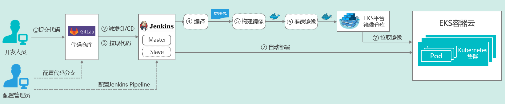
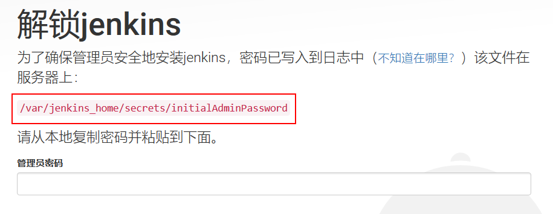
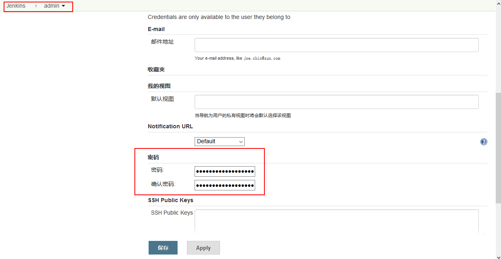
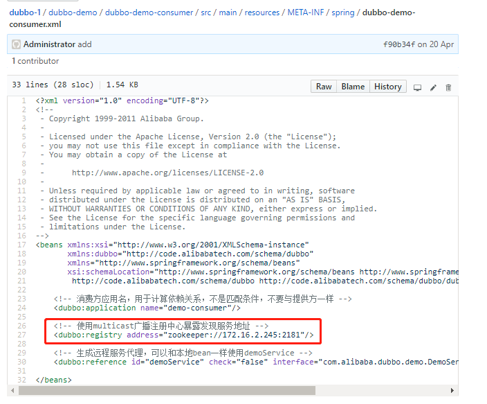
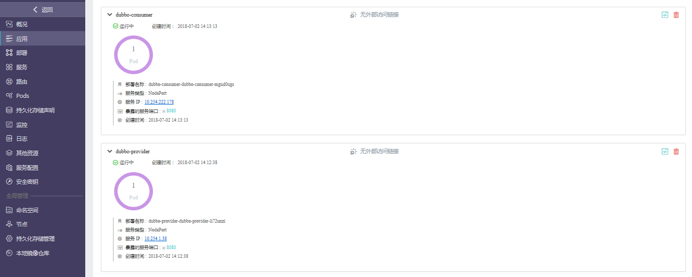

# CI/CD场景实践指南
## 概述
本文档为基于EKS V4.0.2易捷行云容器云平台的CI/CD（持续集成/持续部署）场景实践指南，主要包含以下两部分：  
1. 在EKS平台上部署CI/CD工具链；
2. 借助微服务应用示例，进行CI/CD场景演示。  

## 场景描述  
1. CI/CD工具链基于业界目前主流、通用的开源软件构建，均在EKS平台中基于Kubernetes进行部署。  
<table>
   <tr>
      <td>序号</td>
      <td>用途</td>
      <td>工具</td>
      <td>Docker镜像版本</td>
      <td>说明</td>
   </tr>
   <tr>
      <td>1</td>
      <td>代码版本管理</td>
      <td>GitLab</td>
      <td>gitlab/gitlab-ce:10.7.4-ce.0</td>
      <td></td>
   </tr>
   <tr>
      <td>2</td>
      <td>CI/CD工具</td>
      <td>Jenkins</td>
      <td>jenkinsci/blueocean:1.5.0</td>
      <td>Jenkins Slave节点的镜像需要自己制作</td>
   </tr>
</table>  

2. CI/CD工具链可通过以下两种方式在EKS平台上部署：  
   1）通过EKS平台的UI界面直接完成部署，其中Jenkins Slave通过Jenkins Master调用EKS接口生成；    
   2）通过Helm完成CI/CD工具链在EKS中的部署（待补充）。   

3. 微服务应用示例基于Dubbo微服务框架实现，使用Java编程语言，采用Maven进行编译。CI/CD场景演示主要包括源代码上传、编译、镜像构建、推送镜像以及应用自动部署等。    

## CI/CD流程描述  
在完成CI/CD工具链部署之后，整体CI/CD场景流程图如下所示：  
   
1. 提交代码：开发人员通过Git工具提交代码至GitLab代码仓库的对应分支； 
2. 触发CI/CD：GitLab与Jenkins集成，当检测到相应分支的代码更新时，自动触发CI/CD流水线，Jenkins Master将会在EKS中自动创建Jenkins Slave，并执行后续CI/CD流程；  
3. 拉取代码：Jenkins Slave自动从GitLab中拉取更新的代码；  
4. 代码编译：Jenkins Slave执行代码编译，生成应用包；  
5. 镜像构建：Jenkins Slave执行Docker镜像构建；  
6. 推送镜像：Jenkins Slave将生成的Docker镜像推送至EKS的镜像仓库中；  
7. 自动部署：Jenkins Slave将新版本应用部署至EKS平台中，此过程会从镜像仓库拉取新版本镜像。  


## 操作流程说明  

### 1.在EKS中部署GitLab代码仓库   

**Step 1: 上传GitLab镜像至EKS平台的镜像仓库。**   

首先需要准备一个安装有单机版Docker CE软件的操作系统环境用于上传Docker镜像，可以使用本地虚拟机，也可以使用ECS平台中的云主机，注意需要能够与EKS镜像仓库实现网络互通。  

注意：需要配置Docker Daemon的DOCKER_OPTS参数，添加“--insecure-registry x.x.x.x”参数。  
不同操作系统的配置方式略有差异，请以Docker官方说明为准。  
以本文档所采用的CentOS 7.2.1511为例，可参考以下配置方法：  
```
[root@docker-ce ~]# vi /usr/lib/systemd/system/docker.service
```
配置参考示例如下：  


然后执行：  
```
[root@docker-ce ~]# systemctl daemon-reload  
[root@docker-ce ~]# systemctl restart docker  
```

尝试登陆镜像仓库，参考EKS界面“本地镜像仓库"-"上传镜像"的步骤说明：  


提示“Login Succeed”之后，便可以将本地的镜像推送至镜像仓库。  
首先需将所需版本的GitLab镜像下载到本地（需能够访问外网从Dockerhub拉取镜像）：  
```
[root@docker-ce ~]# docker pull gitlab/gitlab-ce:10.7.4-ce.0
```  

修改镜像的Tag，并上传镜像到EKS平台的镜像仓库中:  
```
[root@docker-ce ~]# docker images
[root@docker-ce ~]# docker tag gitlab/gitlab-ce:10.7.4-ce.0  172.16.0.176/3dc70621b8504c98/gitlab-ce:10.7.4-ce.0
[root@docker-ce ~]# docker push 172.16.0.176/3dc70621b8504c98/gitlab-ce:10.7.4-ce.0
```  

注：GitLab镜像使用指南可参考 https://docs.gitlab.com/omnibus/docker/#run-the-image  

可以在EKS界面查看已上传至镜像仓库的GitLab镜像，接下来会基于它来部署GitLab应用。   


**Step 2: 在EKS容器平台中部署GitLab应用。**  

点击"创建应用"，并选择通过"镜像仓库"开始创建。  

  
  

填写“应用名称”，然后点击“添加服务”，在弹出框中填入服务的各项配置参数。  
填写“服务名称”，选择上一步所上传的GitLab镜像，填入Pod的基本配置：  
  
注意：  
1）GitLab容器消耗计算资源比较多，因此图示中分配了4Cores/4096MiB计算资源；  
2）需要配置持久化存储，将容器的3个目录/var/opt/gitlab （存储应用数据)、 /var/log/gitlab （存储log文件）、 /etc/gitlab（存储配置文件）挂载出来。  

下一步，填写服务（即Kubernetes Service）访问设置，在这里我们选取NodePort方式，将GitLab容器的3个端口（80、22和443）暴露出来，映射服务端口也设为80、22和443，另外，指定对应的节点暴露端口30080、30022和30443，如图示例：
  

下一步，注入环境变量至GitLab容器中，在“高级配置”中进行设置，参考下图：  
  
图示中键填入为： GITLAB_OMNIBUS_CONFIG  
值填入为：  external_url 'http://gitlab.example.org/'; gitlab_rails['gitlab_shell_ssh_port'] = 30022;  
分别代表GitLab的外部访问域名和SSH连接端口，其中外部访问域名还需要在接下来的Ingress路由中设置。  

保存上述配置，便可以部署GitLab应用。  
可在EKS界面查看已经创建完成的GitLab应用。  
  

此时已经可以通过NodePort方式访问GitLab，但是为了在Web浏览器中可直接通过域名（本示例为gitlab.example.org）访问GitLab，我们可以设置路由(Ingress)，提供外部负载均衡访问GitLab界面。  
  
  
注意需要配置DNS域名解析才可通过域名访问GitLab，可采用以下两种方式：  
1）如果环境中有DNS服务器，则直接配置DNS解析即可，例如将上图中的gitlab.example.org映射到Kubernetes集群的某一个Slave节点的公网IP（注意不能为Master节点）；  
2）如果环境中没有DNS服务器，则可以配置本地hosts文件（对Windows而言为C:\Windows\System32\drivers\etc\hosts），添加任意一个Kubernetes Slave节点公网IP与域名的映射关系，对于上图中的示例则可添加一条： 172.16.4.191 gitlab.example.org  

等待3~4分钟GitLab完成初始化之后，即可通过浏览器正常访问GitLab：  
  
注册一个新的账号即可正常使用。  

**Step 3: 设置通过SSH连接GitLab。**  
考虑安全性，我们通过SSH Key Pair方式访问GitLab。(参考：https://docs.gitlab.com/ee/ssh/README.html)    
在Step1中所使用的本地虚拟机中，创建一个GitLab SSH密钥对：（提示：需要设置并牢记私钥密码。）   
```
[root@docker-ce .ssh]# ssh-keygen -t rsa -C "easystack@example.org" -b 4096
```
随后将公钥“gitlab_key.pub”添加到GitLab中，在GitLab的“User Setting”-“SSH Keys”中进行添加：  
   

验证本地虚拟机与GitLab的SSH连通性：  
   


**Step 4: 创建GitLab示例项目。（挪到后面去）**  
我们在GitLab中创建一个示例项目“dubbo-demo”：  
  
  

**Step 5: Push源代码至GitLab。（挪到后面去）**  
首先需要确认所使用的本地虚拟机环境中已经安装了Git，并完成Git global setup配置。  
然后从GitHub上将示例项目的源代码克隆（Clone）到本地虚拟机中：  
```
[root@docker-ce ~]# git clone https://github.com/ylcao/dubbo.git
```
可参考GitLab中界面提示，通过SSH方式进行源代码Push：  
```
[root@docker-ce ~]# cd dubbo/
[root@docker-ce dubbo]# rm -rf .git
[root@docker-ce dubbo]# git init  
[root@docker-ce dubbo]# git remote add origin ssh://git@gitlab.example.org:30022/easystack/dubbo-demo.git  
[root@docker-ce dubbo]# git add .  
[root@docker-ce dubbo]# git commit -m "Initial commit"  
[root@docker-ce dubbo]# git push -u origin master  
```
Push成功后即可在GitLab的“dubbo-demo”项目中看到源代码。  

**Step 6: 修改Dubbo配置文件。（挪到后面去）** 

（1）dubbo/dubbo-demo/dubbo-demo-consumer/src/main/assembly/conf/dubbo.properties

dubbo.registry.address=zookeeper://172.16.2.245:2181

（2）dubbo/dubbo-demo/dubbo-demo-provider/src/main/assembly/conf/dubbo.properties
dubbo.registry.address=zookeeper://172.16.2.245:2181


### 2.在EKS中部署Jenkins
### 2.Jenkins Docker Build配置 
#### 3.1 安装jenkins 

**Step 1: 上传Jenkins镜像至EKS平台的镜像仓库。**
采用与之前下载GitLab镜像类似的方式，首先需将所需版本的GitLab镜像下载到本地，然后推送至EKS平台的镜像仓库。 
```
[root@docker-ce ~]# docker pull jenkinsci/blueocean：1.5.0
[root@docker-ce ~]# docker tag jenkinsci/blueocean：1.5.0  172.16.0.176/3dc70621b8504c98/jenkinsci/blueocean：1.5.0
[root@docker-ce ~]# docker push 172.16.0.176/3dc70621b8504c98/jenkinsci/blueocean：1.5.0
```
注：Jenkins BlueOcean镜像使用指南可参考 https://jenkins.io/doc/book/installing/#downloading-and-running-jenkins-in-docker

可以在EKS界面查看已上传至镜像仓库的Jenkins镜像，接下来会基于它来部署Jenkins Master：  

 


step 3. 在EKS平台上部署jenkins服务：

点击右上角创建应用，选择镜像仓库，选择jenkins镜像


Service配置暴露两个端口，一个是Jenkins Server的访问端口，这里nodePort方式指定的是31888；另一个是Jenkins Agent通信用的端口，默认是50000，如果不暴露的话，Jenkins slave节点是无法和Jenkins Server建了连接的。


注意：jenkins镜像部署成功后，需要在部署的yaml中添加securityContext来修改访问/var/jenkins_home的用户为user 0，即root用户，具体修改如下：


修改完成后，yaml文件会变为：

部署yaml修改完成后，jenkins服务启动正常，在EKS平台查看创建成功的jenkins服务：


jenkins Server要想能与k8s集群的apiserver通信，需要先通过权限认证。k8s里面有个Service Account的概念，配置使用Service Account来实现给Jenkins Server的授权。步骤如下：
使用jenkins-rbac.yaml来创建service Account:
```
kubectl create -f jenkins-rbac.yaml
```
```
jenkins-rbac.yaml
---
apiVersion: v1
kind: ServiceAccount
metadata:
  name: jenkins-admin-new
  namespace: default
---
apiVersion: rbac.authorization.k8s.io/v1beta1
kind: ClusterRoleBinding
metadata:
  name: jenkins-admin-new
roleRef:
  apiGroup: rbac.authorization.k8s.io
  kind: ClusterRole
  name: cluster-admin
subjects:
- kind: ServiceAccount
  name: jenkins-admin-new
  namespace: default
```
查看生成的“service account”如下：


将生成的名为“jenkins-admin-new”的serviceaccount加入jenkins的部署yaml中：


部署yaml修改完成后，jenkins服务启动正常.

访问http://172.16.4.190:30601/地址来访问jenkins，首次登陆jenkins，需要输入初始密码：

使用命令：
```
[escore@ci-akyzklrim5-0-vsx3xunzxan2-kube-master-gko2lwdxza5r ~]$ kubectl get pod
NAME                                                READY     STATUS    RESTARTS   AGE
gitlab-cicd-gitlab-cicd-pfcpzdqa-173637270-tm7cp    1/1       Running   0          1d
gitlab-test-gitlab-test-t2oure6b-1164666112-lms0x   1/1       Running   0          20h
jenkins-jenkins-bj3we2kn-1700231787-sq1l2           1/1       Running   0          12h
[escore@ci-akyzklrim5-0-vsx3xunzxan2-kube-master-gko2lwdxza5r ~]$ kubectl exec -it jenkins-jenkins-bj3we2kn-1700231787-sq1l2 bash
bash-4.4# ls

```
查看初始密码，并输入，进入jenkins页面：


首先修改admin的密码：




#### 3.2	Jenkins插件安装
(用于jenkins的Docker插件调用)

step 1:安装以下jenkins插件：

Docker build step plugin

Git plugin

Gitlab plugin

Gitlab Hook Plugin

Maven Integration plugin

Kubernetes plugin

进入jenkins【系统管理】页面，选择【管理插件】中选择以上插件，并进行安装:


插件安装完成以后，在【系统管理】-【系统设置】-【新增一个云】-【Kubernetes】配置k8s的插件。


参考以上说明，进行配置。标记到的地方，是需要配置的必须信息，可以根据自己的情况进行配置。要注意的是，这里的Name字段配的名字，后面在配置pipeline的Jenkins任务时，是需要用到的（默认名字叫kubernetes）。然后点【Test Connection】，如果前面的Service Account配置的没问题的话，就会提示“Connection successful”，否则，会有访问apiserver的403权限报错。


配置完成后，用pipeline方式创建一个如下的Jenkins构建任务：

```
podTemplate(label: 'testpod', cloud: 'kubernetes') {
    node('testpod') {
        stage('Run shell') {
            sh 'echo hello world'
        }
    }
}

```


点击Jenkins任务构建，观察会自动生成作为slave节点的Pod：


等任务构建完成之后，会发现slave节点又动态的消失了： 


为了完成使用jenkins slave来进行CI工作，需要自己制作一个jenkins slave镜像，并上传到我们的172.16.4.176 harbor中去，自己制作jenkins slave镜像步骤如下：
step 1:使用openshift参考镜像；


jenkins slave镜像制作完成后，使用docker push命令将jenkins slave镜像上传到172.16.4.176 harbor中。
镜像制作成功，并上传后，效果如下：

3.2.1 pipeline1:构建snake镜像
在jenkins master中构建pipieline如下：
```
podTemplate(name: 'jnlp', label: 'jnlp', namesapce: 'default', cloud: 'kubernetes',
  containers: [
        containerTemplate(
            name: 'jnlp',
            image: 'hub.easystack.io/3dc70621b8504c98/jenkins-slave:v1',
            command: '',
            args: '${computer.jnlpmac} ${computer.name}',
            privileged: true,
            alwaysPullImage: false,
            ttyEnabled: true, 
        ),
  ],
  volumes: [hostPathVolume(hostPath: '/var/run/docker.sock', mountPath: '/var/run/docker.sock'),
            hostPathVolume(hostPath: '/usr/bin/docker', mountPath: '/usr/bin/docker'),
            hostPathVolume(hostPath: '/usr/bin/docker-current', mountPath: '/usr/bin/docker-current'),
            hostPathVolume(hostPath: '/etc/sysconfig/docker', mountPath: '/etc/sysconfig/docker'),
            hostPathVolume(hostPath: '/usr/bin/kubectl', mountPath: '/usr/bin/kubectl')]
  ) {

  node('jnlp') {
    stage('devops for snake game') {
        container('jnlp') {
            stage("clone snake code") {
                git 'https://github.com/luluwangwang1989/Snake.git'
            }
            
            stage('unit test') {
                sh 'echo "unit test command"'
            }
            
            stage('build docker image') {
                sh """
                    docker login -u 3dc70621b8504c98 -p Tcdf4f05247d79dd7 hub.easystack.io
                    docker build -t hub.easystack.io/3dc70621b8504c98/snake:${BUILD_NUMBER} .
                    docker push hub.easystack.io/3dc70621b8504c98/snake:${BUILD_NUMBER}
                """
            }
            
            stage('deploy to k8s') {
                
                sh """kubectl set image deployment/snake snake=hub.easystack.io/captain/snake:${BUILD_NUMBER}"""
            }
        }
    }
 }
}
```
其中“  image: 'hub.easystack.io/3dc70621b8504c98/jenkins-slave:v1'”指明我们前面构建的jenkins slave镜像。
“git 'https://github.com/luluwangwang1989/Snake.git'”将snake源码从github上拉取下来。
使用
```
 stage('build docker image') {
                sh """
                    docker login -u 3dc70621b8504c98 -p Tcdf4f05247d79dd7 hub.easystack.io
                    docker build -t hub.easystack.io/3dc70621b8504c98/snake:${BUILD_NUMBER} .
                    docker push hub.easystack.io/3dc70621b8504c98/snake:${BUILD_NUMBER}
                """
            }
```
这几步将snake build成docker 镜像，并push到我们的harbor中去。

使用EKS将构建成功的snake镜像进行部署：


snake部署成功，可以正常访问：


3.2.2 构建dubbo镜像
使用以下pipeline script构建dubbo镜像：

```
podTemplate(name: 'jnlp', label: 'jnlp', namespace: 'default', cloud: 'kubernetes',
  containers: [
        containerTemplate(
            name: 'jnlp',
            image: 'hub.easystack.io/3dc70621b8504c98/jenkins-slave-maven:latest',
            command: '',
            args: '${computer.jnlpmac} ${computer.name}',
            privileged: true,
            alwaysPullImage: false,
            ttyEnabled: true, 
        ),
  ],
  volumes: [hostPathVolume(hostPath: '/var/run/docker.sock', mountPath: '/var/run/docker.sock'),
            hostPathVolume(hostPath: '/usr/bin/docker', mountPath: '/usr/bin/docker'),
            hostPathVolume(hostPath: '/usr/bin/docker-current', mountPath: '/usr/bin/docker-current'),
            hostPathVolume(hostPath: '/etc/sysconfig/docker', mountPath: '/etc/sysconfig/docker'),
            hostPathVolume(hostPath: '/usr/bin/kubectl', mountPath: '/usr/bin/kubectl')]
  ) {

  node('jnlp') {
    stage('devops for dubbo') {
        container('jnlp') {
            stage("clone dubbo code") {
                git 'https://github.com/PabloZhong/dubbo-1.git'
            }
            stage('compile') {
                
            
                echo 'Hello, Maven'
                sleep 10
                sh 'java -version'
                dir('/home/jenkins/workspace/dubbo-old/dubbo-demo')
                {
                
                sh '/opt/rh/rh-maven33/root/usr/bin/mvn clean install'
                }

            }
            
            stage('build docker image') {
                sh """
                    docker login -u 3dc70621b8504c98 -p Tcdf4f05247d79dd7 hub.easystack.io
                    
                    docker build -t hub.easystack.io/3dc70621b8504c98/dubbo-consumer:v11 /home/jenkins/workspace/dubbo-old/dubbo-demo/dubbo-demo-consumer
                    
                    docker push hub.easystack.io/3dc70621b8504c98/dubbo-consumer:v11
                                
                    docker build -t hub.easystack.io/3dc70621b8504c98/dubbo-provider:v11 /home/jenkins/workspace/dubbo-old/dubbo-demo/dubbo-demo-provider
                    
                    docker push hub.easystack.io/3dc70621b8504c98/dubbo-provider:v11

                    
                """
            }
            
        }
    }
 }
}
```
使用“image: 'hub.easystack.io/3dc70621b8504c98/jenkins-slave-maven:latest'”镜像作为jenkins的slave镜像， 
使用“git 'https://github.com/PabloZhong/dubbo-1.git'”拉取dubbo源码，使用“mvn clean install”编译dubbo代码，生成jar包。

使用“docker build -t hub.easystack.io/3dc70621b8504c98/dubbo-consumer:v11 /home/jenkins/workspace/dubbo-old/dubbo-demo/dubbo-demo-consumer”命令构建dubbo-consumer容器镜像，

使用“docker build -t hub.easystack.io/3dc70621b8504c98/dubbo-provider:v11 /home/jenkins/workspace/dubbo-old/dubbo-demo/dubbo-demo-provider”构建dubbo-provider容器镜像，
并通过“docker push”命令推送到镜像仓库中去。
其中dubbo-consumer的Dockefile文件如下：
```
FROM openjdk:8-jre
ADD target/dubbo-demo-consumer-2.5.7-assembly.tar.gz /dubbo
COPY start-docker.sh /dubbo/dubbo-demo-consumer-2.5.7/bin/

CMD ["sh","-c","/dubbo/dubbo-demo-consumer-2.5.7/bin/start-docker.sh"]

```
dubbo-provider的Dockfile文件如下：
```
FROM openjdk:8-jre
ADD target/dubbo-demo-provider-2.5.7-assembly.tar.gz /dubbo
COPY start-docker.sh /dubbo/dubbo-demo-provider-2.5.7/bin/

CMD ["sh","-c","/dubbo/dubbo-demo-provider-2.5.7/bin/start-docker.sh"]

```
在此要注意，需要修改dubbo源码路径下的dubbo-demo-consumer.xml和dubbo-demo-provider.xml文件中的zookeeper地址



dubbo-consumer,dubbo-provider镜像成功构建并且推送到镜像仓库后，下一步要通过ECS和EKS部署使用dubbo。
3.3 在ECS+EKS环境里面将dubbo应用落地


在该场景里面采用ECS里面的大数据组件来实现zookeeper集群的快速部署，提供dubbo应用架构的服务注册中心，采用EKS来部署dubbo应用，dubbo应用分为两类，一类是提供服务的provider，另一类是消费服务的consumer，两类服务均采用容器部署的方式部署，部署步骤如下：
**Step 1 - 部署zookeeper集群作为dubbo应用中的注册中心**
1.创建zookeeper网络


2.创建zookeeper集群


**Step 2 - 部署dubbo应用**

1.创建应用依赖配置文件
```
dubbo.properties
[escore@ci-akyzklrim5-0-vsx3xunzxan2-kube-master-gko2lwdxza5r opt]$ cat dubbo.properties 
dubbo.container=log4j,spring
dubbo.application.name=demo-provider
dubbo.application.owner=
dubbo.registry.address=zookeeper://172.16.4.123:2181?backup=172.16.4.122:2181,172.16.4.124:2181
dubbo.monitor.protocol=registry
dubbo.protocol.name=dubbo
dubbo.protocol.port=20880
dubbo.service.loadbalance=roundrobin
dubbo.log4j.file=logs/dubbo-demo-provider.log
dubbo.log4j.level=WARN

```
2、创建应用依赖configmap

```
kubectl create configmap dubbo-config --from-file=dubbo.properties
```
3.在EKS环境里面部署dubbo-provider和dubbo-consumer应用


部署成功后，查看应用运行情况：



**场景 1 - 查看服务调用效果**

1.查看运行pod


2.查看服务注册情况
登陆zookeeper集群：


3.查看服务注册情况：


从以上四步，我们可以看出provider服务在注册中心（zookeeper集群）注册成功，同时consumer调用成功，说明我们可以将dubbo场景下的微服务在ECS+EKS下落地。


